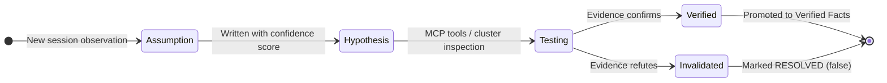
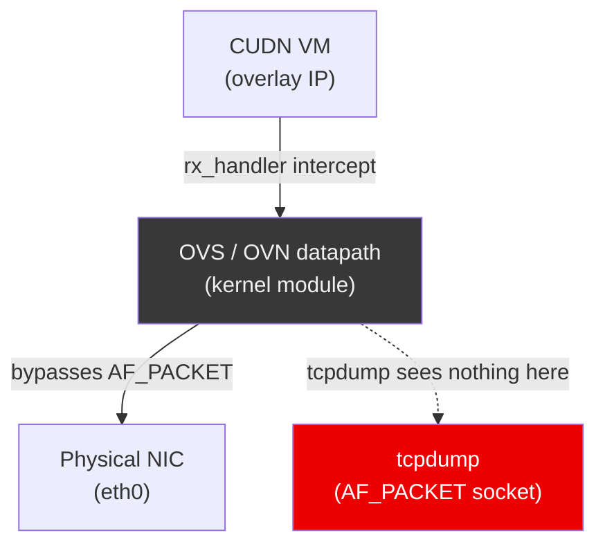
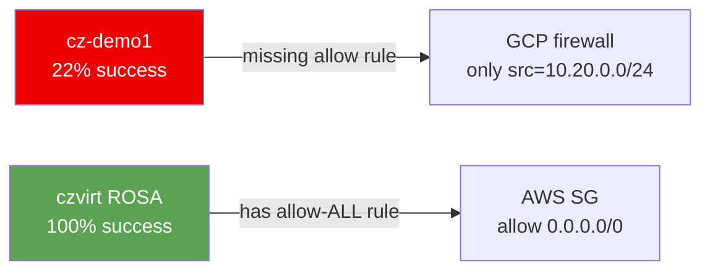
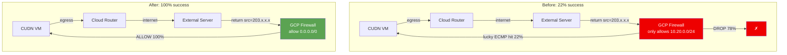

# Slidev Presentation Implementation Plan

> **For agentic workers:** REQUIRED SUB-SKILL: Use superpowers:subagent-driven-development (recommended) or superpowers:executing-plans to implement this plan task-by-task. Steps use checkbox (`- [ ]`) syntax for tracking.

**Goal:** Build a conference-ready Slidev presentation from `docs/project-timeline-2026.md` Section 16, deployable as a static site to GitHub Pages.

**Architecture:** A single Slidev project under `presentation/` with a custom Red Hat brand theme (CSS variables), reusable Vue layout components, Mermaid diagrams, and Slidev-native animated components replacing the existing standalone HTML packet-flow artifacts. A GitHub Actions workflow builds and deploys `dist/` to `gh-pages`.

**Tech Stack:** [Slidev](https://sli.dev) · Vue 3 · Mermaid (built-in) · UnoCSS (built-in) · GitHub Actions (`peaceiris/actions-gh-pages`)

---

## Conference abstract (CFP)

**Maintained here** for conference CfPs (e.g. DevOpsDays: culture + story + evidence, not a tool pitch), including **speaker bio**. Trim the **Short** block (or **Speaker bio**) for hard limits; the **spine** below stays stable unless you consciously revise the talk’s promise.

**Spine (do not drift without an intentional talk change):** (1) Most “AI coding” fails for *boring* misalignment: no shared rules, no ground truth, no explicit control of context. (2) **Joint engineering** means treating the **environment as the product**: reviewed rules, pinned references, evidence before edits, tools that force the model to touch reality instead of narrating from memory.

**Title:** *Beyond vibe coding: Less vibes, more receipts*  
*(Optional subtitle: Joint engineering with AI, a field report, ~110 sessions, production networking / BGP on OpenShift Dedicated + GCP.)*

**Abstract (submission-ready, ~240 words):**

Most “AI coding” fails for boring reasons: no shared rules, no ground truth, and no one deciding which context the model is even allowed to see. The failure mode looks like velocity right up until production disagrees. At that point you are debugging trust and handoffs, not just code.

**Joint engineering is the opposite:** you treat the environment as the product. That means reviewed rules, pinned references, evidence before edits, and tools so the model touches reality instead of narrating from memory. This is a **field report**, not a vendor story, about **~110 focused sessions in seven weeks** on a real platform problem: dynamic **BGP and routing** in a **managed OpenShift** footprint on **GCP**. I will be blunt about who owned **judgment** versus **speed**, how **outsiders** and hallway-level hints actually fed the loop, and when we **restarted** work instead of letting bad context compound.

The stress test is a **long debugging arc on live infrastructure** (intermittent egress, packet captures, dead-end hypotheses, then a clear root cause), not a scripted lab. It is a good look at what broke when we slid back toward “vibe” habits, and what still held when we did not. You will leave with a **practical frame** for accountable AI in critical paths. That includes how to structure rules and evidence, when to throw away a session, and which collaboration patterns still work when the problem is messy and the wrong story is tempting.

**For** platform engineers, SREs, and technical leads who want **patterns and scars**, not another hero demo.

**Short (~140 words, tight CfPs / character limits):** Most “AI coding” fails for boring misalignment: no shared rules, no ground truth, no control of what the model sees. **Joint engineering** treats the **environment as the product** in the same way: reviewed rules, pinned references, evidence before edits, and tools that force the model to touch reality. This field report covers **~110 sessions in seven weeks** on real **BGP / routing** work in **OpenShift on GCP**: judgment vs. speed, how outsiders fed the loop, and when we **restarted** instead of poisoning context. A **long live-cluster investigation** is the stress test. It shows what broke when we skipped the discipline, and what held when we did not. **Takeaways:** a practical frame for accountable AI in critical paths; when to reset context; collaboration lessons from failure. **Audience:** platform engineers, SREs, and leads. Emphasis on culture and practice, not a product pitch.

**DevOpsDays checklist (self-review when submitting):** Hook (misalignment / trust) · Clear problem (vibe coding vs. joint engineering) · Evidence (sessions + live-cluster debugging) · **What you’ll learn** (frame, reset, collaboration) · Culture/collab emphasis · No sales · Audience named · **Bold / fresh angle** (joint engineering as ops culture, not toolchain).

**Speaker bio (CFP / program book):** Paul Czarkowski is a Senior Principal Cloud Specialist at Red Hat, with more than twenty years in cloud, Kubernetes, and DevOps. He spent over fifteen years in the US tech industry before returning to Brisbane; that stretch shaped how he thinks about scale and practice in large engineering cultures. He has spoken at KubeCon, DevOpsDays, and other events. He cares about open source and real production systems. [tech.paulcz.net](https://tech.paulcz.net) · [github.com/paulczar](https://github.com/paulczar)

---

## Source Material

Before implementing, the executing agent **must** read these files in full:

- `docs/project-timeline-2026.md` — Section 16 (Presentation Outline) is the primary spec; earlier sections provide the narrative prose for speaker notes and slide body copy
- `docs/cudn-ecmp-drop-flow.html` — existing animated packet-flow diagram to be **rebuilt natively** in Slidev (do not iframe)
- `docs/cudn-rfc1918-success-flow.html` — second animated packet-flow diagram to be rebuilt natively

---

## File Structure

```
presentation/
  slides.md                        # All slides — single source of truth
  package.json                     # Slidev + dependencies
  .github/
    workflows/
      deploy.yml                   # Build + deploy to gh-pages
  components/
    RhTwoColumn.vue                # Reusable two-column layout
    RhTable.vue                    # Styled table component
    SpectrumDiagram.vue            # Vibe coding → joint engineering spectrum bar
    PacketFlowEcmp.vue             # Animated ECMP drop packet flow (replaces cudn-ecmp-drop-flow.html)
    PacketFlowSuccess.vue          # Animated success packet flow (replaces cudn-rfc1918-success-flow.html)
    Timeline.vue                   # Project milestone timeline (7 weeks)
  styles/
    rh-theme.css                   # Red Hat brand CSS variables + global overrides
  public/
    rh-logo.svg                    # Red Hat logo SVG (from brand.redhat.com public assets)
```

**Slide count target:** 32–38 slides across 10 sections + title + closing.

---

## Red Hat Brand Reference

Use these values throughout — do not invent alternatives:

| Token | Value |
|---|---|
| Primary red | `#EE0000` |
| Dark background | `#1A1A1A` |
| Surface / card bg | `#242424` |
| Border / divider | `#383838` |
| Body text | `#F0F0F0` |
| Muted text | `#A8A8A8` |
| Accent blue | `#73BCF7` |
| Accent green (success) | `#5BA352` |
| Accent yellow (warning) | `#F0AB00` |
| Heading font | `Red Hat Display` (Google Fonts) |
| Body font | `Red Hat Text` (Google Fonts) |

Slidev theme: use `theme: default` with a custom `styles/rh-theme.css`. Do not use a community theme — the brand CSS overrides are sufficient.

---

## Task 1: Project Scaffold

**Files:**
- Create: `presentation/package.json`
- Create: `presentation/slides.md` (title slide only at this stage)
- Create: `presentation/styles/rh-theme.css`

- [ ] **Step 1: Initialise the Slidev project**

```bash
cd presentation
npm init -y
npm install @slidev/cli @slidev/theme-default
```

- [ ] **Step 2: Write `package.json` with exact scripts**

```json
{
  "name": "joint-engineering-presentation",
  "private": true,
  "scripts": {
    "dev": "slidev slides.md --open",
    "build": "slidev build slides.md --base /osd-gcp-cudn-routing/",
    "export": "slidev export slides.md"
  },
  "dependencies": {
    "@slidev/cli": "^0.49.0",
    "@slidev/theme-default": "^0.24.0"
  }
}
```

> **Note on `--base`:** The `--base` flag must match the GitHub repo name for GH Pages subpath routing. If the repo is renamed, update this value.

- [ ] **Step 3: Write `styles/rh-theme.css`**

```css
@import url('https://fonts.googleapis.com/css2?family=Red+Hat+Display:wght@400;500;600;700;900&family=Red+Hat+Text:wght@400;500;600&display=swap');

:root {
  --rh-red: #EE0000;
  --rh-bg: #1A1A1A;
  --rh-surface: #242424;
  --rh-border: #383838;
  --rh-text: #F0F0F0;
  --rh-muted: #A8A8A8;
  --rh-blue: #73BCF7;
  --rh-green: #5BA352;
  --rh-yellow: #F0AB00;
}

.slidev-layout {
  background: var(--rh-bg);
  color: var(--rh-text);
  font-family: 'Red Hat Text', sans-serif;
}

h1, h2, h3 {
  font-family: 'Red Hat Display', sans-serif;
  color: var(--rh-text);
}

h1 { border-left: 4px solid var(--rh-red); padding-left: 0.75rem; }

a { color: var(--rh-blue); }

.slidev-code { background: #0d0d0d !important; }

/* Section header slides */
.section-header h1 {
  font-size: 3rem;
  color: var(--rh-red);
  border: none;
  padding: 0;
}

/* Two-column grid utility */
.cols-2 {
  display: grid;
  grid-template-columns: 1fr 1fr;
  gap: 2rem;
}

.tag {
  display: inline-block;
  background: var(--rh-red);
  color: white;
  font-size: 0.7rem;
  font-family: 'Red Hat Display', sans-serif;
  font-weight: 700;
  letter-spacing: 0.1em;
  text-transform: uppercase;
  padding: 0.2rem 0.6rem;
  border-radius: 2px;
  margin-bottom: 0.5rem;
}
```

- [ ] **Step 4: Write title slide stub in `slides.md`**

```markdown
---
theme: default
title: "Joint Engineering with AI"
info: |
  Joint Engineering with AI: How We Built and Debugged a Production BGP Routing System
  Red Hat Managed OpenShift Black Belt — Paul Czarkowski
css: styles/rh-theme.css
highlighter: shiki
lineNumbers: false
fonts:
  sans: Red Hat Text
  serif: Red Hat Display
  mono: JetBrains Mono
---

# Joint Engineering with AI

## How We Built and Debugged a Production BGP Routing System

<div class="mt-8 text-[var(--rh-muted)]">
Paul Czarkowski · Red Hat Managed OpenShift Black Belt · 2026
</div>

---
```

- [ ] **Step 5: Verify dev server starts**

```bash
cd presentation && npm run dev
```

Expected: Slidev opens at `http://localhost:3030` showing a single dark slide with the title.

- [ ] **Step 6: Commit**

```bash
git add presentation/
git commit -m "feat(presentation): scaffold Slidev project with RH brand theme"
```

---

## Task 2: GitHub Actions Deploy Workflow

**Files:**
- Create: `presentation/.github/workflows/deploy.yml`

> Note: Slidev requires Node 18+. The workflow builds from `presentation/` and deploys `presentation/dist/` to `gh-pages`.

- [ ] **Step 1: Write the workflow**

```yaml
name: Deploy Presentation to GitHub Pages

on:
  push:
    branches: [main]
    paths:
      - 'presentation/**'

permissions:
  contents: write

jobs:
  deploy:
    runs-on: ubuntu-latest
    steps:
      - uses: actions/checkout@v4

      - uses: actions/setup-node@v4
        with:
          node-version: '20'
          cache: 'npm'
          cache-dependency-path: presentation/package-lock.json

      - name: Install dependencies
        run: npm ci
        working-directory: presentation

      - name: Build slides
        run: npm run build
        working-directory: presentation

      - name: Deploy to gh-pages
        uses: peaceiris/actions-gh-pages@v4
        with:
          github_token: ${{ secrets.GITHUB_TOKEN }}
          publish_dir: ./presentation/dist
```

- [ ] **Step 2: Commit**

```bash
git add presentation/.github/
git commit -m "ci(presentation): add GitHub Pages deploy workflow"
```

---

## Task 3: Reusable Vue Components

**Files:**
- Create: `presentation/components/RhTwoColumn.vue`
- Create: `presentation/components/RhTable.vue`
- Create: `presentation/components/SpectrumDiagram.vue`

These are used across multiple slides — build them before writing slide content.

- [ ] **Step 1: Write `RhTwoColumn.vue`**

```vue
<template>
  <div class="cols-2">
    <div class="left"><slot name="left" /></div>
    <div class="right"><slot name="right" /></div>
  </div>
</template>
```

- [ ] **Step 2: Write `RhTable.vue`**

A styled table that accepts `headers` (string array) and `rows` (string[][] ) props.

```vue
<script setup>
defineProps({ headers: Array, rows: Array })
</script>

<template>
  <table class="rh-table w-full text-sm">
    <thead>
      <tr>
        <th v-for="h in headers" :key="h"
            class="text-left py-2 px-3 border-b border-[var(--rh-border)]
                   font-['Red_Hat_Display'] text-[var(--rh-red)] uppercase text-xs tracking-wider">
          {{ h }}
        </th>
      </tr>
    </thead>
    <tbody>
      <tr v-for="(row, i) in rows" :key="i"
          class="border-b border-[var(--rh-border)] hover:bg-[var(--rh-surface)]">
        <td v-for="(cell, j) in row" :key="j" class="py-2 px-3">{{ cell }}</td>
      </tr>
    </tbody>
  </table>
</template>
```

- [ ] **Step 3: Write `SpectrumDiagram.vue`**

A horizontal bar showing the spectrum from "Vibe Coding" to "Joint Engineering", with the active position highlighted. Used on slide 3.

```vue
<script setup>
const stages = [
  { label: 'Code\nAutocomplete', icon: '⌨️' },
  { label: 'Chat\nAssistant', icon: '💬' },
  { label: 'Agent\nwith Tools', icon: '🔧' },
  { label: 'Joint Engineering\nPartner', icon: '🤝', active: true },
]
</script>

<template>
  <div class="flex items-stretch gap-0 mt-6 rounded overflow-hidden border border-[var(--rh-border)]">
    <div v-for="(s, i) in stages" :key="i"
         :class="[
           'flex-1 flex flex-col items-center justify-center py-4 px-2 text-center text-xs',
           s.active
             ? 'bg-[var(--rh-red)] text-white font-bold'
             : 'bg-[var(--rh-surface)] text-[var(--rh-muted)]'
         ]">
      <div class="text-2xl mb-2">{{ s.icon }}</div>
      <div class="whitespace-pre-line leading-tight font-['Red_Hat_Display']">{{ s.label }}</div>
    </div>
  </div>
  <div class="flex justify-between text-[10px] text-[var(--rh-muted)] mt-1 px-1">
    <span>← vibe coding</span>
    <span>joint engineering →</span>
  </div>
</template>
```

- [ ] **Step 4: Commit**

```bash
git add presentation/components/
git commit -m "feat(presentation): add reusable Vue components (table, two-column, spectrum)"
```

---

## Task 4: Animated Packet Flow Components

These replace the standalone `docs/cudn-ecmp-drop-flow.html` and `docs/cudn-rfc1918-success-flow.html` files. Build them natively as Vue components with CSS animation so the presentation is fully self-contained.

**Files:**
- Create: `presentation/components/PacketFlowEcmp.vue`
- Create: `presentation/components/PacketFlowSuccess.vue`

Before implementing, **read** `docs/cudn-ecmp-drop-flow.html` and `docs/cudn-rfc1918-success-flow.html` in full to understand the topology, node labels, and animation logic — then rebuild the same semantics in Vue.

**Topology for both diagrams:**
- Source: CUDN VM (overlay IP, e.g. `10.128.0.x`)
- Path: OVN overlay → worker node → Cloud Router (NCC) → VPC route → internet
- ECMP diagram: packet hits wrong worker (no BGP session), gets dropped at `ct_state=!est`
- Success diagram: packet takes correct ECMP path, exits via masquerade worker, returns via firewall allow rule

**Animation approach:** Use CSS `@keyframes` with staggered `animation-delay` to move a "packet" dot along SVG paths. Keep it simple — a moving circle with a color change (green = success, red = drop) is sufficient.

- [ ] **Step 1: Write `PacketFlowEcmp.vue`** (the drop scenario)

The component renders an SVG diagram with:
- 3 worker node boxes labeled `worker-0`, `worker-1 (BGP active)`, `worker-2`
- A "CUDN VM" box connected to each worker via the OVN overlay
- A Cloud Router box at the top
- A packet dot that travels: VM → worker-0 → Cloud Router → (return path misses) → DROP (red flash)
- A label: `ct_state=!est → DROP`

Use `v-once` so the animation plays on slide entry. Full implementation required — no placeholder.

- [ ] **Step 2: Write `PacketFlowSuccess.vue`** (the success scenario)

Same topology but:
- Packet travels: VM → worker-1 (BGP active) → Cloud Router → internet → return via firewall allow → VM (green checkmark)
- Label: `allow 0.0.0.0/0 → 100% success`

- [ ] **Step 3: Commit**

```bash
git add presentation/components/PacketFlow*.vue
git commit -m "feat(presentation): add native animated packet flow Vue components"
```

---

## Task 5: Slide Content — Sections 1–4

Write the slide content for the first half of the presentation into `slides.md`. Prose for speaker notes and bullets comes directly from `docs/project-timeline-2026.md` Section 16.

**Section 1 — What Is Joint Engineering? (~4 slides)**
**Section 2 — The Origin Story (~5 slides)**
**Section 3 — Scaffolding the Agent (~6 slides)**
**Setup Aside — Practical Toolchain (~2 slides)**

**Files:**
- Modify: `presentation/slides.md`

- [ ] **Step 1: Add Section 1 slides**

```markdown
---
layout: section
class: section-header
---

# Section 1
## What Is Joint Engineering?

---

# Vibe Coding vs. Joint Engineering

<RhTwoColumn>
  <template #left>

  ### Vibe Coding
  - Generate code, paste it in
  - Hope it works, iterate blindly
  - AI as a fast autocomplete
  - No shared context, no accountability

  </template>
  <template #right>

  ### Joint Engineering
  - Shared context, accumulated knowledge
  - Evidence-based debugging
  - AI investigates before guessing
  - Mutual accountability

  </template>
</RhTwoColumn>

<!--
Speaker note: The framing here sets everything that follows. The question isn't
"is AI useful?" — it's "what kind of use produces reliable production engineering?"
-->

---

# The Spectrum of AI Use

<SpectrumDiagram />

<div class="mt-6 text-[var(--rh-muted)] text-sm">

This talk is about the rightmost position — and what it takes to get there.

</div>

---

# What Changes When AI Is a Partner

- **Maintains state across sessions** — KNOWLEDGE.md, AGENTS.md, ARCHITECTURE.md
- **Investigates before guessing** — evidence-based debugging section in AGENTS.md
- **Reviews its own work** — mandatory self-review before every response
- **You provide what only a human can**: judgment, priorities, domain authority, the right question at the right time

> *"Not a success story about AI being smart. A story about building an environment where AI can be disciplined."*

---

# This Talk

<div class="cols-2">
<div>

**7 weeks · 2 repos · 110 sessions**

One human + one AI building a production BGP routing system for OpenShift Virtualization on GCP — from scratch.

Including a multi-day debugging investigation with packet captures, live cluster inspection, and a smoking-gun discovery.

</div>
<div>

**What we'll cover:**

1. The origin story
2. Scaffolding the agent
3. How we worked
4. The knowledge system
5. Novel debugging techniques
6. Finding the smoking gun
7. The human in the loop
8. Takeaways

</div>
</div>
```

- [ ] **Step 2: Add Section 2 slides (Origin Story)**

```markdown
---
layout: section
class: section-header
---

# Section 2
## The Origin Story

---

# The Terraform Provider

A story unto itself — the proving ground.

- Paul wanted a TF provider for OSD on GCP. No one had built one. He decided to build it himself.
- Setup: **keel scaffolding first**, then `references/` folder:
  - RHCS TF provider source, OCM SDK, OCM CLI, OCM OpenAPI spec (153 endpoints), GCP OSD modules
- Result: a working, published Terraform provider — in what would normally be weeks of solo engineering

> *"Don't prompt from memory — give the agent the authoritative source."*

<!-- IMAGE REQUEST: A simple graphic showing the references/ folder as "fuel" feeding into the AI engine.
     Use Gemini image generation or similar. Style: technical diagram, dark background, RH red accent. -->

---

# A Slack Message on March 18

> *"Hi Paul, need your help in building out the AWS Route Server equivalent on GCP — using GCP Cloud Router. I used Claude to generate equivalent steps for OSD."*
> — Shreyans Mulkutkar, OSD GCP Product Manager

**Claude's draft: 1,126 lines. Right idea. Fundamental errors.**

<RhTable
  :headers="['What Claude Proposed', 'What Was Actually Needed']"
  :rows="[
    ['AWS-style peer routing', 'GCP NCC + Router Appliance spoke'],
    ['Static VPC routes', 'BGP advertisements via FRR on every worker'],
    ['No operator', 'CRD-based operator (routing.osd.redhat.com/v1alpha1)'],
    ['Missing canIpForward', 'canIpForward + disable-connected-check on NCC VMs'],
    ['Flat VPC assumed', 'Hub/spoke VPC topology required'],
  ]"
/>

---

# Claude vs. Cursor

<RhTwoColumn>
  <template #left>

  ### Claude (for scoping)
  - Confirmed the approach was architecturally sound
  - Generated a 1,126-line starting point
  - Good for exploring the problem space

  </template>
  <template #right>

  ### Cursor (for production engineering)
  - Made it correct
  - Read the authoritative GCP and OCP source docs
  - Ran in the live cluster
  - Built the operator, CI, and reference deployment

  </template>
</RhTwoColumn>

> *Claude confirmed the direction. Cursor built the thing.*

---

# Paul's Response

> *"I've been planning on taking a run at it."*

Same method that worked for the TF provider:
- Keel scaffolding first
- References folder: GCP NCC docs, OCM SDK, rosa-bgp reference implementation
- Joint engineering from session one

**March 26: first commit in `osd-gcp-cudn-routing`.**
```

- [ ] **Step 3: Add Section 3 slides (Scaffolding)**

```markdown
---
layout: section
class: section-header
---

# Section 3
## Scaffolding the Agent

---

# The Agent's Constitution: AGENTS.md

<div class="tag">AGENTS.md open standard</div>

**[Project Keel](https://github.com/paulczar/keel)** — Paul's open source tool for standardized AI coding rules

- Implements the [AGENTS.md open standard](https://agentmdx.com) (Linux Foundation, supported by Codex, Copilot, Jules, Cursor)
- Hugo-powered CMS: author rules once as Markdown, sync to any project in any AI tool format
- Rules live in Git, are reviewed via PRs, have full audit history

> *"You're not prompting an AI. You're engineering an environment — and working inside it together."*

<!-- IMAGE REQUEST: The Keel layering model diagram — keel defaults → org standards → local overrides.
     Three stacked horizontal layers with arrows flowing down. RH dark theme. -->

---

# What AGENTS.md Encodes

Three sections that changed the behavior most:

**1. Debugging section:** "evidence before edits" — investigate before changing code  
**2. Self-review section:** "what would a senior engineer critique?" — mandatory before every response  
**3. GCP constraints section:** institutional memory, never repeated

```markdown
## Known confirmed GCP API constraints (do not repeat these mistakes):

- `google_compute_region_backend_service` with `load_balancing_scheme = "INTERNAL"`
  requires `balancing_mode = "CONNECTION"` — UTILIZATION is rejected.
- `google_compute_address` with `purpose = "SHARED_LOADBALANCER_VIP"` cannot be used
  as `next_hop_ilb` — use a plain INTERNAL address.
- `depends_on = [module.foo]` on a module defers all data sources to apply-time,
  breaking for_each key resolution. Pass outputs directly as inputs instead.
```

---

# When Scaffolding Is Missing: The `depends_on` Footgun

```hcl
# BAD — defers all data sources inside module.spoke to apply-time
module "route" {
  source     = "./modules/vpc-route"
  depends_on = [module.spoke]   # ← breaks for_each at plan time
}

# GOOD — implicit ordering via attribute reference
module "route" {
  source   = "./modules/vpc-route"
  spoke_id = module.spoke.id    # ← Terraform resolves ordering automatically
}
```

**Root cause:** no rule enforcing "prefer implicit dependencies; never `depends_on` on modules"  
**Fix:** written into `AGENTS.md` and `terraform.md` — never repeated across the remaining 50 sessions

> *"AI coding mistakes are often scaffolding gaps, not model failures. Fix the rules, not the model."*

---

# The GCP "Things It Doesn't Tell You" List

Each of these is a one-time mistake. Each became a permanent rule.

<RhTable
  :headers="['Mistake', 'What Actually Happened', 'Rule Written']"
  :rows="[
    ['self_link for cross-VPC ILB next hop', 'API rejects with misleading error', 'Use ip_address not self_link'],
    ['SHARED_LOADBALANCER_VIP address purpose', 'Incompatible with next_hop_ilb routes', 'Use plain INTERNAL address'],
    ['nftables on RHEL 9', 'Service starts but loads wrong config file', 'Write to /etc/sysconfig/nftables.conf'],
    ['depends_on on modules', 'Defers data sources to apply-time', 'Pass outputs as inputs instead'],
  ]"
/>

---

# ARCHITECTURE.md vs. KNOWLEDGE.md

<RhTwoColumn>
  <template #left>

  ### ARCHITECTURE.md
  Stable design decisions  
  Reviewed and curated  
  The "what we decided"  
  Changes via PR  

  </template>
  <template #right>

  ### KNOWLEDGE.md
  Living evidence  
  Confidence scores  
  Falsifiable hypotheses  
  The "what we learned"  
  Updated every session  

  </template>
</RhTwoColumn>

```markdown
## Verified Facts

### ECMP and Multi-path BGP (confidence: 95%)
GCP Cloud Router accepts multiple BGP peers advertising the same prefix
and installs ECMP routes in the VPC routing table. Verified via `gcloud`
route inspection April 2026.
```

---
layout: section
class: section-header
---

# Setup Aside
## Practical Joint Engineering Toolchain

---

# The Context Degradation Problem

<!-- IMAGE REQUEST: A line graph showing output quality vs context % used.
     Quality is high from 0-50%, then drops sharply after 50%.
     Label the cliff: "context poisoning zone". RH dark theme, red accent. -->

- **The longer a session runs, the more the AI forgets earlier constraints and starts hallucinating**
- Context degrades noticeably past ~50% of the context window

**Rules that emerged:**
- Don't let context exceed 50%. Start fresh rather than continuing a poisoned session.
- Use `npx cc-status-line@latest` — adds a status bar showing model, context %, session cost
- Dispatch sub-agents for large tasks (each runs in its own clean context window)

> *"This talk is itself an example: many of the 110 sessions deliberately started fresh."*
```

- [ ] **Step 4: Verify slides render without error**

```bash
cd presentation && npm run dev
```

Navigate to slides 1–22 in the browser. Confirm no Vue component errors in the terminal.

- [ ] **Step 5: Commit**

```bash
git add presentation/slides.md
git commit -m "feat(presentation): add sections 1-4 slide content"
```

---

## Task 6: Slide Content — Sections 5–7

**Section 5 — The Knowledge System (~3 slides)**
**Section 6 — Novel Debugging Techniques (~5 slides)**
**Section 7 — The Investigation: Smoking Gun (~5 slides)**

- [ ] **Step 1: Add Section 5 slides (Knowledge System)**

```markdown
---
layout: section
class: section-header
---

# Section 5
## The Knowledge System

---

# KNOWLEDGE.md: Hypothesis Lifecycle



---

# The Bridge-vs-Masquerade False Lead

**The data:** bridge VMs failed internet egress. Masquerade VMs appeared to work.  
**The hypothesis:** VM networking mode is the differentiator.  
**The reality:** coincidental ECMP hits — not a structural difference.

KNOWLEDGE.md documented the correction. Future sessions couldn't rediscover the false lead.

> *"A confident-looking data point that was simply wrong. KNOWLEDGE.md saved us."*

This is why confidence scores and falsifiability matter — not just to record what you know,  
but to prevent future sessions from re-convincing themselves of something already disproven.

---

# The OVN-K `ct.est` Hypothesis

- **Written:** `ct_state=!est` drops were consistent with the 22% success rate data
- **Tested:** OVN flow tables inspected via `ovs-ofctl` across all workers
- **Corrected:** the drops were real but the *root cause* was not OVN — it was the GCP firewall

> *"The AI maintained the hypothesis. The human asked the right question that refuted it."*
```

- [ ] **Step 2: Add Section 6 slides (Debugging Techniques)**

```markdown
---
layout: section
class: section-header
---

# Section 6
## Novel Debugging Techniques

---

# tmux MCP: Parallel tcpdump Across All Workers

<!-- IMAGE REQUEST: A screenshot-style mockup of a tmux session with 5 panes,
     each showing tcpdump output on a different worker node. Dark terminal aesthetic.
     Label each pane: worker-0 through worker-4. -->

- **The problem:** internet egress was succeeding ~22% of the time — inconsistently across workers
- **The tool:** tmux MCP + `kubectl exec` — fan out tcpdump to all 5 workers simultaneously
- Each worker in its own pane, capturing ICMP and TCP egress traffic in real time

```bash
# tmux MCP dispatched this across all 5 workers in parallel:
kubectl exec -n openshift-ovn-kubernetes \
  ovnkube-node-xxxxx -c ovnkube-node -- \
  tcpdump -i any -n 'icmp or (tcp and port 80)' -c 50
```

> *"Without tmux MCP, this is 5 separate terminal tabs and a lot of context switching."*

---

# Wireshark MCP: Querying PCAPs Programmatically

```python
# Wireshark MCP query — find retransmissions in the egress PCAP
wireshark.query(
  file="references/pcap-2026-04-23/egress-worker1.pcap",
  filter="tcp.analysis.retransmission",
  fields=["frame.number", "ip.src", "ip.dst", "tcp.seq"]
)
```

- **Result:** retransmissions concentrated on workers without active BGP sessions
- **Confirmed:** return traffic was arriving at the wrong worker (ECMP state mismatch)

> *"The PCAP told the story. The MCP let the AI read it directly."*

---

# The Invisible OVS Datapath



> *"tcpdump on an OVN-K worker shows nothing for CUDN pod traffic. OVS intercepts at the rx_handler level, before AF_PACKET. You need `ovs-ofctl` or `ovs-appctl` to see the actual datapath."*

---

# Canvas → Slidev: Animated Packet Flows

The packet flow diagrams were originally built as standalone HTML canvas artifacts.  
For this presentation, they are rebuilt natively as Vue components.

**The ECMP drop scenario:** packet from CUDN VM hits wrong ECMP worker, return path fails

<PacketFlowEcmp />

---

# Canvas → Slidev: The Success Path

**After the fix:** firewall rule covers `0.0.0.0/0`, any worker can handle the return

<PacketFlowSuccess />
```

- [ ] **Step 3: Add Section 7 slides (The Smoking Gun)**

```markdown
---
layout: section
class: section-header
---

# Section 7
## The Investigation: Finding the Smoking Gun

---

# The Symptom

- **~22% internet egress success** from CUDN VMs on GCP (`cz-demo1`)
- Intermittent: sometimes worked, often didn't — no clear pattern
- OVN flows looked correct. BGP sessions established. Routes advertised.

**First hypothesis:** `ct_state=!est` drops in OVN-K conntrack — consistent with the data.

```bash
# OVN flow inspection showed this rule was active:
ct_state=-trk,ip actions=ct(table=...)
ct_state=+trk+est,ip actions=resubmit(,...)
ct_state=+trk-est,ip actions=drop   # ← suspected culprit
```

---

# The ROSA Comparison

**Parallel cluster:** `czvirt` on ROSA HCP, `eu-central-1`, OCP 4.21.9 — **100% egress success**

- Identical OCP version. Identical OVN-K flows. Identical FRR BGP config.
- ROSA used single-active routing — only one BGP peer active at a time.

**Paul's question:** *"If ROSA uses single-active routing, why does it still work?"*

Cross-cluster inspection revealed: ROSA has `rosa-virt-allow-from-ALL-sg` — a security group  
allowing all inbound traffic from the VPC.



---

# The Question That Cracked It

> *"Is it the GCP stateful firewall?"*
> — Paul Czarkowski

**The rule:** `cz-demo1-hub-to-spoke-return` covered `src=10.20.0.0/24` only — the spoke subnet.  
**The gap:** return traffic from the internet arrives with `src=0.0.0.0/0` — not covered.

```hcl
# The fix — one Terraform resource:
resource "google_compute_firewall" "allow_return_traffic" {
  name    = "cz-demo1-allow-internet-return"
  network = google_compute_network.hub.name

  allow { protocol = "all" }

  source_ranges = ["0.0.0.0/0"]   # allow return traffic from anywhere
  target_tags   = ["osd-worker"]
}
```

**Verification:** 50/50 requests = 100% success. Immediately.

---

# Before / After: Firewall Rule


```

- [ ] **Step 4: Verify slides render**

```bash
cd presentation && npm run dev
```

Check that all Mermaid diagrams render, Vue components mount without errors, and the animated packet flow components display correctly.

- [ ] **Step 5: Commit**

```bash
git add presentation/slides.md
git commit -m "feat(presentation): add sections 5-7 slide content with Mermaid diagrams"
```

---

## Task 7: Slide Content — Sections 8–10 + Closing

**Section 8 — Human in the Loop (~4 slides)**
**Section 9 — What We Produced (~2 slides)**
**Section 10 — Takeaways (~3 slides)**
**Closing slide**

- [ ] **Step 1: Add Section 8–10 slides**

```markdown
---
layout: section
class: section-header
---

# Section 8
## Human in the Loop

---

# The Moments That Mattered

<RhTable
  :headers="['What Paul said', 'Why it mattered']"
  :rows="[
    ['\'Do nothing\'', 'Stopped a false debugging path before it wasted hours'],
    ['\'Stop talking about EgressIP\'', 'Boundary setting — AI kept returning to a solved problem'],
    ['\'Is it the GCP stateful firewall?\'', 'The question that cracked the 7-day investigation'],
    ['\'Validate commands before giving them to me\'', 'Quality feedback that changed agent behavior permanently'],
    ['\'If ROSA works, why?\'', 'Cross-domain pattern recognition the AI couldn\'t supply alone'],
  ]"
/>

> *"The AI uses context you give it. The human decides what context is worth surfacing."*

---

# Daniel Axelrod: The External Human in the Loop

A Slack thread turned into three architectural changes:

1. **"All workers as peers"** — Slack narration → changed from single-active to all-workers-as-BGP-peers
2. **exec-then-SSH** — unlocked VM debugging from inside CUDN pods
3. **Terminus-2 link** — reference to Harbor's tmux-based agent led directly to tmux MCP adoption (same day)

> *"Expert practitioners drop high-signal hints in casual conversation. Learn to hear them."*

---

# The Human's Irreplaceable Role

<RhTwoColumn>
  <template #left>

  **What the AI did well:**
  - Maintained context across 65 sessions
  - Ran parallel tcpdump across all workers
  - Read PCAPs, queried Kubernetes, wrote Terraform
  - Generated hypotheses consistent with the data
  - Reviewed its own work before showing it

  </template>
  <template #right>

  **What only the human could do:**
  - Cross-domain pattern recognition (ROSA → GCP firewall)
  - Knowing when to stop a false path
  - Deciding which external threads were worth surfacing
  - Setting boundaries and priorities
  - Asking the right question at the right time

  </template>
</RhTwoColumn>

---
layout: section
class: section-header
---

# Section 9
## What We Produced

---

# The Artifacts

<div class="cols-2">
<div>

**Infrastructure**
- Working Terraform provider for OSD on GCP
- Complete BGP routing reference (Terraform + Operator)
- CRD: `routing.osd.redhat.com/v1alpha1 BGPRoutingConfig`
- CI pipeline + UBI Dockerfile

</div>
<div>

**Knowledge**
- `KNOWLEDGE.md` — 65 sessions of institutional memory
- `ARCHITECTURE.md` — stable design record
- `docs/bgp-cudn-guide.md` — shareable BGP dummies guide
- PCAP analysis + Wireshark filters
- This presentation

</div>
</div>

---
layout: section
class: section-header
---

# Section 10
## Takeaways

---

# Patterns to Steal

1. **Scaffold first** — `AGENTS.md` + keel rules + `ARCHITECTURE.md` before writing any code
2. **Give the AI access to the systems it's reasoning about** — MCP tools are force multipliers; without them the agent is blind
3. **Manage knowledge deliberately** — `KNOWLEDGE.md` with confidence scores retained context across 65 sessions
4. **Manage context actively** — don't let sessions exceed 50%; start fresh; dispatch sub-agents
5. **The human's role shifts** — from writing code to providing judgment, direction, and domain authority

---

# The Toolchain

<RhTable
  :headers="['Tool', 'What it enabled']"
  :rows="[
    ['Kubernetes MCP', 'Live cluster inspection — pods, nodes, OVN flows, BGP peers'],
    ['tmux MCP', 'Parallel tcpdump across all workers simultaneously'],
    ['Wireshark MCP', 'Programmatic PCAP querying — retransmission filters, flow analysis'],
    ['Context7', 'GCP and OCP authoritative docs fetched at decision time, not from memory'],
    ['Canvas → Slidev', 'Shareable animated diagrams as first-class artifacts'],
    ['Keel / AGENTS.md', 'Agent scaffolding — the environment that made discipline possible'],
  ]"
/>

---
layout: center
class: text-center
---

# You're not prompting an AI.

<div class="text-[var(--rh-red)] text-3xl font-['Red_Hat_Display'] font-bold mt-4">
You're engineering an environment —<br />and working inside it together.
</div>

<div class="mt-12 text-[var(--rh-muted)] text-sm">

[github.com/paulczar/keel](https://github.com/paulczar/keel) ·
[tech.paulcz.net/keel](https://tech.paulcz.net/keel) ·
[agentmdx.com](https://agentmdx.com)

</div>
```

- [ ] **Step 2: Verify full slide deck renders**

```bash
cd presentation && npm run dev
```

Navigate all slides end-to-end. Confirm: no Vue errors, all Mermaid diagrams render, all table data displays, closing slide renders centered.

- [ ] **Step 3: Commit**

```bash
git add presentation/slides.md
git commit -m "feat(presentation): add sections 8-10 and closing slide"
```

---

## Task 8: Timeline Component

The Section 4 narrative calls for a timeline graphic mapping 7 weeks of sessions to milestones. This is complex enough to warrant its own task.

**Files:**
- Create: `presentation/components/Timeline.vue`
- Modify: `presentation/slides.md` (add Timeline component to Section 4 slide)

- [ ] **Step 1: Write `Timeline.vue`**

A horizontal timeline with labeled milestones. Data is hardcoded from the project chronicle.

```vue
<script setup>
const milestones = [
  { date: 'Mar 4', label: 'TF Provider\nstarts', week: 1, repo: 'tf-provider' },
  { date: 'Mar 18', label: 'Slack message\nfrom Shreyans', week: 2, repo: 'tf-provider' },
  { date: 'Mar 26', label: 'First commit\nosd-gcp-cudn', week: 3, repo: 'cudn' },
  { date: 'Mar 30', label: 'BGP pivot\n(no ILB)', week: 4, repo: 'cudn' },
  { date: 'Apr 2', label: 'Go controller\nstarts', week: 5, repo: 'cudn' },
  { date: 'Apr 13', label: 'Operator /\nCRD design', week: 6, repo: 'cudn' },
  { date: 'Apr 17', label: 'Egress\ninvestigation', week: 7, repo: 'cudn' },
  { date: 'Apr 23', label: 'Smoking gun\nfound', week: 8, repo: 'cudn' },
]
const colors = { 'tf-provider': '#73BCF7', 'cudn': '#EE0000' }
</script>

<template>
  <div class="relative mt-4">
    <!-- baseline -->
    <div class="h-0.5 bg-[var(--rh-border)] w-full absolute top-6" />
    <div class="flex justify-between relative">
      <div v-for="m in milestones" :key="m.date" class="flex flex-col items-center" style="flex: 1">
        <div class="w-3 h-3 rounded-full z-10 mt-[18px]"
             :style="{ background: colors[m.repo] }" />
        <div class="text-[10px] text-center mt-2 text-[var(--rh-muted)] leading-tight whitespace-pre-line">
          {{ m.label }}
        </div>
        <div class="text-[9px] text-[var(--rh-border)] mt-1">{{ m.date }}</div>
      </div>
    </div>
    <div class="flex gap-4 mt-4 text-[10px]">
      <span><span class="inline-block w-2 h-2 rounded-full bg-[#73BCF7] mr-1" />tf-provider-osd-google</span>
      <span><span class="inline-block w-2 h-2 rounded-full bg-[#EE0000] mr-1" />osd-gcp-cudn-routing</span>
    </div>
  </div>
</template>
```

- [ ] **Step 2: Add timeline slide to Section 4**

In `slides.md`, add this slide after the Section 4 header slide:

```markdown
# 110 Sessions · 7 Weeks · Two Repos

<Timeline />

<div class="mt-4 text-sm text-[var(--rh-muted)]">

45 sessions in `tf-provider-osd-google` · 65 sessions in `osd-gcp-cudn-routing`

</div>
```

- [ ] **Step 3: Commit**

```bash
git add presentation/components/Timeline.vue presentation/slides.md
git commit -m "feat(presentation): add project timeline Vue component"
```

---

## Task 9: Build Verification + GH Pages Test

- [ ] **Step 1: Run a full production build**

```bash
cd presentation && npm run build
```

Expected: `dist/` directory created with `index.html` and all assets. No build errors.

- [ ] **Step 2: Preview the built output locally**

```bash
cd presentation && npx serve dist
```

Open `http://localhost:3000` and navigate all slides. Confirm:
- All slides render correctly
- Mermaid diagrams display
- Animated Vue components work
- No 404s for fonts or assets

- [ ] **Step 3: Verify GH Pages base path is correct**

The `--base /osd-gcp-cudn-routing/` flag in `package.json` must match the GitHub repo name. Check:

```bash
git remote get-url origin
```

If the repo name is different from `osd-gcp-cudn-routing`, update `package.json`:

```json
"build": "slidev build slides.md --base /<actual-repo-name>/"
```

- [ ] **Step 4: Push and verify GitHub Actions workflow runs**

```bash
git push origin main
```

In the GitHub Actions tab, confirm the `Deploy Presentation to GitHub Pages` workflow completes successfully. Visit `https://<github-username>.github.io/osd-gcp-cudn-routing/` to confirm the live deployment.

- [ ] **Step 5: Final commit if any fixes needed**

```bash
git add presentation/
git commit -m "fix(presentation): production build corrections"
```

---

## Image Generation Notes

The following slides have `<!-- IMAGE REQUEST: -->` comments marking places where an AI-generated image would improve the slide. Use **Gemini** (or equivalent image generation tool) after the Slidev build is complete:

| Slide | Request |
|---|---|
| Section 2 — TF Provider | `references/` folder as "fuel" feeding into an AI engine. Dark bg, RH red accent, technical diagram style. |
| Section 3 — Keel layers | Three stacked horizontal layers: "keel defaults → org standards → local overrides". Arrow flows down. |
| Setup Aside — Context degradation | Line graph: output quality vs context % used. Sharp drop after 50%. Label: "context poisoning zone". |
| Section 6 — tmux MCP | Terminal mockup: 5 tmux panes, each showing tcpdump output on a labeled worker node (worker-0 through worker-4). |

---

## Self-Review

**Spec coverage check against Section 16 of `docs/project-timeline-2026.md`:**

| Spec item | Task |
|---|---|
| Vibe coding vs joint engineering | Task 5, Section 1 |
| Spectrum diagram | Task 3, SpectrumDiagram.vue |
| The TF provider origin story | Task 5, Section 2 |
| Claude vs Cursor comparison table | Task 5, Section 2 |
| Keel / AGENTS.md (agent environment) | Task 5, Section 3 |
| `depends_on` footgun | Task 5, Section 3 |
| GCP "things it doesn't tell you" list | Task 5, Section 3 |
| ARCHITECTURE.md vs KNOWLEDGE.md | Task 5, Section 3 |
| Context degradation / 50% rule | Task 5, Setup Aside |
| Sub-agents / workflow | Task 5, Setup Aside |
| 110 sessions timeline | Task 8, Timeline.vue |
| KNOWLEDGE.md hypothesis lifecycle | Task 6, Section 5 |
| Bridge-vs-masquerade false lead | Task 6, Section 5 |
| tmux MCP parallel tcpdump | Task 6, Section 6 |
| Wireshark MCP PCAP querying | Task 6, Section 6 |
| Invisible OVS datapath | Task 6, Section 6 |
| Packet flow animated diagrams | Task 4, PacketFlow*.vue |
| 22% egress symptom | Task 6, Section 7 |
| ROSA comparison | Task 6, Section 7 |
| Smoking gun: GCP firewall rule | Task 6, Section 7 |
| Before/after firewall diagram | Task 6, Section 7 |
| "Do nothing" / boundary moments | Task 7, Section 8 |
| Daniel Axelrod contributions | Task 7, Section 8 |
| What was produced | Task 7, Section 9 |
| Takeaways / patterns to steal | Task 7, Section 10 |
| MCP toolchain table | Task 7, Section 10 |
| GH Pages deployment | Task 2 + Task 9 |
| Red Hat brand theme | Task 1 |

All spec items covered. No gaps found.
