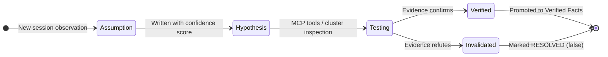
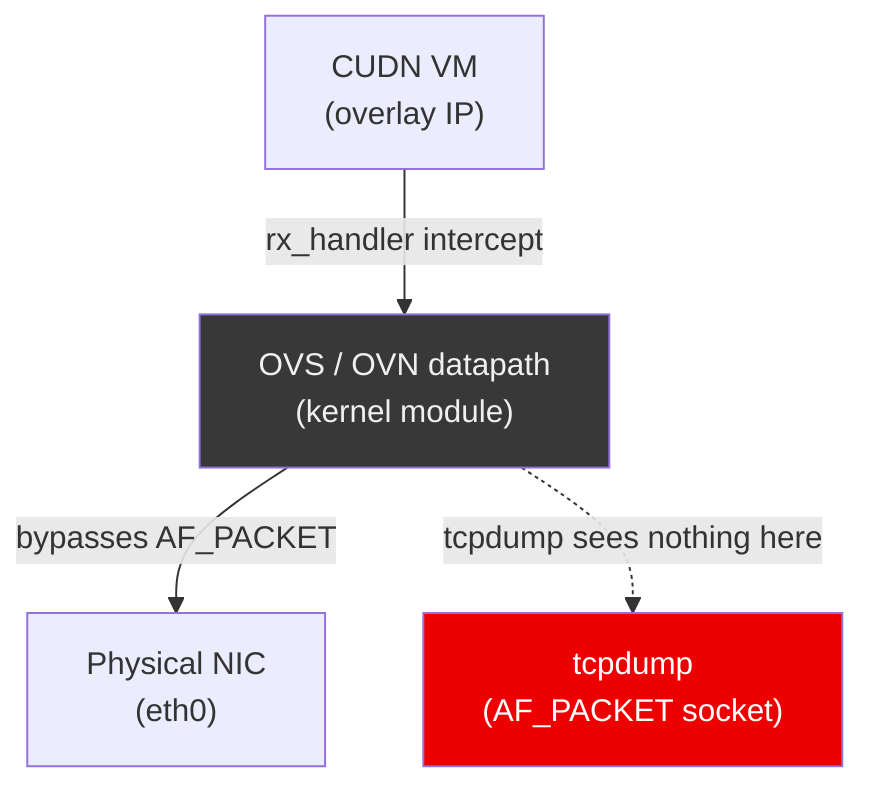
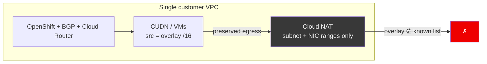
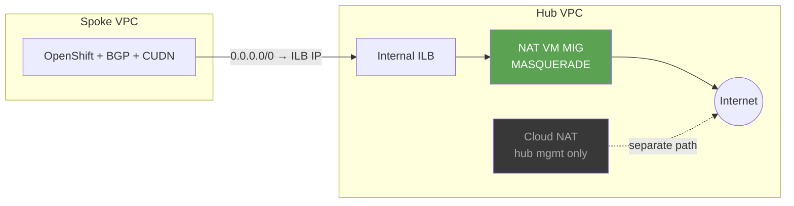
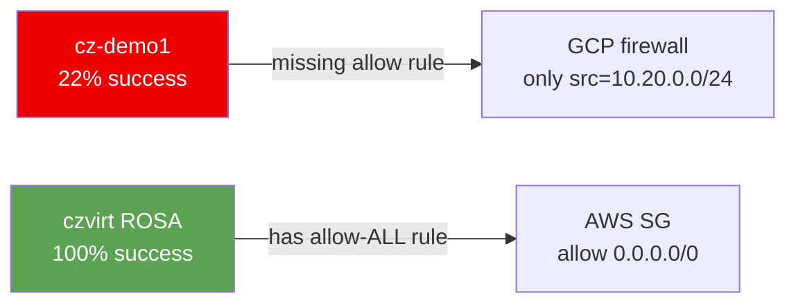
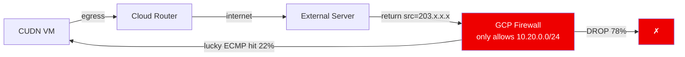
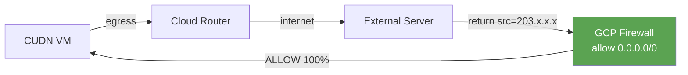

# Beyond vibe coding: Less vibes, more receipts

## How we built and debugged production BGP routing (OpenShift Dedicated on GCP)

<div class="mt-8 text-[var(--rh-muted)]">
Paul Czarkowski · Red Hat Managed OpenShift Black Belt · 2026<br>
Cursor AI (Claude Sonnet) · Cursor IDE · 2026
</div>

<!--
Welcome everyone. I'm Paul Czarkowski, a Managed OpenShift Black Belt at Red Hat. The title is deliberate: joint engineering with AI means less narrative confidence and more receipts—rules, ground truth, and reviewed environment. The story is production BGP on OpenShift Dedicated for GCP and a week-long egress investigation—not a vibe-coding demo.
-->

---

# Meet the Team

<div class="cols-2 mt-2 gap-6 text-sm leading-snug [&_h3]:!text-xl [&_h3]:!mt-0 [&_h3]:!mb-1">
<div class="flex flex-col items-center text-center">


### Paul Czarkowski
<div class="rh-tag mb-2">Human</div>

Senior Principal Cloud SA · Red Hat

20+ years in cloud, Kubernetes, and DevOps. Docker in production since 2014; Kubernetes since 2015. KubeCon, DevOpsDays, worldwide.

Open source advocate. BBQ pitmaster. Cannot spell BGP.

<div class="mt-1.5 text-[var(--rh-muted)] text-xs">

[tech.paulcz.net](https://tech.paulcz.net) · [github.com/paulczar](https://github.com/paulczar)

</div>
</div>
<div class="flex flex-col items-center text-center">

<div class="w-28 h-28 shrink-0 rounded-full mb-2 border-2 border-[var(--rh-blue)] flex items-center justify-center text-4xl" style="background: var(--rh-surface)">🤖</div>

### Cursor AI (Sonnet)
<div class="rh-tag mb-2" style="background: var(--rh-blue)">AI</div>

Powered by Claude Sonnet · Cursor IDE · 2026

110 sessions. Reads 153-endpoint OpenAPI specs without flinching. BGP, GCP NCC, Terraform, Go operators.

Investigates before guessing; self-reviews output. No BBQ — understands smoked packets.

<div class="mt-1.5 text-[var(--rh-muted)] text-xs">

[cursor.com](https://cursor.com) · Context window: managed carefully

</div>
</div>
</div>

<!--
Quick speaker intros — keep this light and fast, 60 seconds max. The joke about "cannot spell BGP" lands well here and sets up the collaboration frame. The Cursor bio gets a laugh from technical audiences who've worked with AI tools.
-->

---

<div class="osd-gcp-arch-slide">

# What Is OpenShift Dedicated on GCP?

**OpenShift Dedicated (OSD)** is a fully managed Red Hat OpenShift cluster running in your GCP project — Red Hat operates the control plane, you run workloads.

<div class="osd-gcp-arch-slide__figure">

</div>

</div>

<!--
I want to ground you in the platform before the BGP story. OpenShift Dedicated on GCP means the customer's VPC and worker nodes live in their project, while Red Hat runs the control plane. Workers reach the internet through Cloud NAT; the architecture PNG is the mental model we'll keep coming back to when we talk about routing and firewalls. If the audience asks for detail: customer VPC and workers in their subnets, Red Hat runs API/etcd/ingress/SRE, Virt runs VMs in pods — all visible in the diagram.
-->

---

# The Customer Problem

Customers running **OpenShift Virtualization** on GCP want to access VMs directly from their network — without `virtctl`, without Kubernetes Services, without NAT.

<div class="cols-2 mt-6">
<div>

**Current reality:**

```
Corporate Network
      │
      ▼
  Worker Node IP (SNATed)
      │
      ▼  (you never see the VM IP)
   CUDN VM  10.128.0.x
```

- VMs have no stable, externally-routable IP
- After live migration, the VM moves nodes — any IP-based routing breaks
- External services can't address VMs directly

</div>
<div>

**Desired state:**

```
Corporate Network
      │
      ▼
   CUDN VM  10.128.0.x  ←──── direct!
```

- VM IP is routable from anywhere in the VPC
- IP survives live migration
- No SNAT, no proxy, no Kubernetes Service needed
- Works exactly like a traditional VM on a network segment

</div>
</div>

<!--
This is the question that kicked everything off. Customers running KubeVirt VMs on a CUDN want corporate networks to reach the VM's real overlay IP—no virtctl port-forward, no Service indirection, no SNAT to a worker. Today the path goes through the worker and breaks on live migration; the desired state is boring L3: the VM IP is just routable in the VPC.
-->

---

# Why This Hadn't Been Done on GCP

The solution is BGP — advertise the CUDN `/16` overlay prefix into the VPC routing table, so every worker's pod IPs are reachable directly.

<RhTable
  :headers="['Platform', 'Status', 'Notes']"
  :rows="[
    ['On-premises (OVN-K)', 'Done ✓', 'BGP with FRR, native L3 network, well understood'],
    ['AWS (ROSA)', 'Demoed ✓', 'AWS Route Server, reference impl by Daniel Axelrod'],
    ['GCP (OSD)', 'Not done ✗', 'NCC Router Appliance required — specific components unknown'],
  ]"
/>

<div class="mt-6 text-[var(--rh-muted)] text-sm">

GCP's equivalent of AWS Route Server is **Network Connectivity Center (NCC) with a Router Appliance spoke** — a non-obvious choice that requires `canIpForward`, `disable-connected-check`, and a hub/spoke VPC topology. None of this was documented as a working OCP pattern.

</div>

<!--
The fix is BGP: advertise the CUDN /16 into the VPC so every worker's pod CIDR is reachable. On-prem OVN-K and AWS ROSA already had patterns; on GCP the missing piece was NCC with a Router Appliance spoke—not a straight Cloud Router clone of AWS Route Server. That's why this was genuinely greenfield for OSD on GCP.
-->

---

# One More Thing: Paul Doesn't Know BGP

<div class="text-center mt-8">

> *"I can barely spell BGP."*
> — Paul Czarkowski, repeatedly, throughout this project

</div>

<div class="cols-2 mt-8">
<div>

**What Paul brought:**
- Deep OSD/GCP/OpenShift platform knowledge
- Experience with the on-prem FRR BGP pattern
- Access to the live cluster
- Judgment about what matters

</div>
<div>

**What the AI brought:**
- BGP protocol knowledge (eBGP, ECMP, multi-hop, route advertisement)
- GCP NCC / Cloud Router API details
- The ability to read 153-endpoint OCM OpenAPI specs without complaining
- Patience for `terraform plan` output

</div>
</div>

<div class="mt-6 text-center text-[var(--rh-muted)] text-sm">

*Teaser for the split — after the agenda slide we’ll put up the full human-vs-AI scorecard, outsiders, and Daniel before the origin story.*

</div>

<!--
I'll own this up front: I say "I can barely spell BGP"—and I mean it. What I brought was OSD, GCP, and OpenShift depth plus live cluster access; what the AI brought was real BGP mechanics, NCC and Cloud Router APIs, and the patience to chew through a 153-endpoint OCM OpenAPI spec. Right after "This Talk" we unpack the same idea in depth (two-column + outsiders + Daniel), then we start the project story in Section 2.
-->

---
layout: section
class: section-header
---

# Section 1
## What Is Joint Engineering?

<!--
Now let's look at what I actually mean by "joint engineering" versus just using an AI as a faster autocomplete—because that framing is what everything else hangs on.
-->

---

# Vibe Coding vs. Joint Engineering

<RhTwoColumn>
  <template #left>

  ### Vibe Coding
  - Generate code, paste it in
  - Hope it works, iterate blindly
  - AI as a fast autocomplete
  - No shared context, no accountability

  </template>
  <template #right>

  ### Joint Engineering
  - Shared context, accumulated knowledge
  - Evidence-based debugging
  - AI investigates before guessing
  - Mutual accountability

  </template>
</RhTwoColumn>

<!--
Speaker note: The framing here sets everything that follows. The question isn't
"is AI useful?" — it's "what kind of use produces reliable production engineering?"
-->

---

# The Spectrum of AI Use

<SpectrumDiagram />

<div class="mt-6 text-[var(--rh-muted)] text-sm">

This talk is about the rightmost position — and what it takes to get there.

</div>

<!--
The spectrum runs from code autocomplete through chat assistants and tool-using agents to what I'm calling a joint engineering partner. This talk isn't cheerleading for "smarter models"—it's about what you have to build around the model to land on that right-hand side reliably.
-->

---

# What Changes When AI Is a Partner

- **Maintains state across sessions** — KNOWLEDGE.md, AGENTS.md, ARCHITECTURE.md
- **Investigates before guessing** — evidence-based debugging section in AGENTS.md
- **Reviews its own work** — mandatory self-review before every response
- **You provide what only a human can**: judgment, priorities, domain authority, the right question at the right time

> *"Not a success story about AI being smart. A story about building an environment where AI can be disciplined."*

<!--
When AI is a partner, it keeps state in the repo—KNOWLEDGE.md, AGENTS.md, ARCHITECTURE.md—investigates before it edits, and self-reviews before it shows you work. Your job shifts to judgment, priorities, and knowing which question to ask. After the agenda slide we’ll put up the **full** human-vs-AI two-column plus outsiders and Daniel—then the origin story.
-->

---

# This Talk

<div class="cols-2">
<div>

**7 weeks · 2 repos · 110 sessions**

One human + one AI building a production BGP routing system for OpenShift Virtualization on GCP — from scratch.

Including a multi-day debugging investigation with packet captures, live cluster inspection, and a smoking-gun discovery.

</div>
<div>

**What we'll cover:**

1. **Who does what** — human, AI, and expert outsiders (before the story)
2. The origin story
3. The agent environment
4. How we worked
5. The knowledge system
6. Novel debugging techniques
7. Finding the smoking gun
8. **In-loop moments** — interventions during the investigation (callbacks to #1)
9. Takeaways

</div>
</div>

<!--
Seven weeks, two repos, about a hundred and ten sessions. Right after this outline: three slides that frame **who does what**—AI vs human vs people outside the chat—plus Daniel as a concrete outsider—*then* the origin story and the rest. The investigation section later is short on-purpose: you already have the role model; there we only surface the phrases that redirected the agent mid-crisis.
-->

---

# The Human's Irreplaceable Role

<RhTwoColumn>
  <template #left>

  **What the AI did well:**
  - Maintained context across 65 sessions
  - Ran parallel tcpdump across all workers
  - Read PCAPs, queried Kubernetes, wrote Terraform
  - Generated hypotheses consistent with the data
  - Reviewed its own work before showing it

  </template>
  <template #right>

  **What only the human could do:**
  - Cross-domain pattern recognition (ROSA → GCP firewall)
  - Knowing when to stop a false path
  - Deciding which external threads were worth surfacing — **watercooler / Slack as R&D**, not noise
  - Setting boundaries and priorities
  - Asking the right question at the right time

  </template>
</RhTwoColumn>

<!--
We put this up front so the case study has a scorecard: left column is what the agent scaled; right column is what still needed Paul—especially feeding outsider signal into the session before it evaporated. The closing line of the talk (“engineering an environment”) is the same contract.
-->

---

# Expert outsiders & the watercooler

- **Outsiders with real craft** (another cloud, routing, kernels) see patterns your chat context never contains — they **collapse search space** the model cannot brute-force.
- **Watercooler effect:** breakthroughs often arrive as **casual, low-stakes signal** — a Slack one-liner, a hallway “have you tried…?”, a link without a ticket. Social timing matters as much as the technical hint.
- **Make it possible:** publish enough detail that experts can correct you; stay in **weak-tie, high-trust** networks; when someone credible speaks, **surface it into the agent’s context** before the moment evaporates.

> *The breakthrough is rarely a formal review — it’s someone who doesn’t live in your repo noticing what everyone inside stopped seeing.*

<!--
Joint engineering with AI is not “lock yourself in a room with Cursor.” Harvest signal from people who aren’t in the session—Slack-as-watercooler is part of R&D infrastructure.
-->

---

# Daniel Axelrod: The External Human in the Loop

A Slack thread turned into three architectural changes:

1. **"All workers as peers"** — Slack narration → changed from single-active to all-workers-as-BGP-peers
2. **exec-then-SSH** — unlocked VM debugging from inside CUDN pods
3. **Terminus-2 link** — reference to Harbor's tmux-based agent led directly to tmux MCP adoption (same day)

> *"Expert practitioners drop high-signal hints in casual conversation. Learn to hear them."*

<!--
Daniel wasn’t in the Cursor sessions, but Slack from him changed architecture three times—concrete proof of the outsider + watercooler slide you just saw. Now the origin story: how we got into BGP on GCP in the first place.
-->

---
layout: section
class: section-header
---

# Section 2
## The Origin Story

<!--
Here's where the project actually started—the Terraform provider wasn't a sideshow; it was the proving ground for the same joint-engineering pattern we reused for BGP.
-->

---

# The Terraform Provider

A story unto itself — the proving ground.

- Paul wanted a TF provider for OSD on GCP. No one had built one. He decided to build it himself.
- Setup: **Keel + AGENTS.md first**, then `references/` folder:
  - RHCS TF provider source, OCM SDK, OCM CLI, OCM OpenAPI spec (153 endpoints), GCP OSD modules
- Result: a working, published Terraform provider — in what would normally be weeks of solo engineering

> *"Don't prompt from memory — give the agent the authoritative source."*

<!-- IMAGE REQUEST: A simple graphic showing the references/ folder as "fuel" feeding into an AI engine.
     Use Gemini image generation or similar. Style: technical diagram, dark background, RH red accent. -->

<!--
Nobody had shipped a Terraform provider for OSD on GCP, so I built one first—Keel plus AGENTS.md and rules, then a fat references/ folder: RHCS provider source, OCM SDK, CLI, the full OpenAPI spec with 153 endpoints, and GCP modules. The lesson I want you to steal: don't make the model guess; clone the authoritative sources and work from those.
-->

---

# A Slack Message on March 18

> *"Hi Paul, need your help in building out the AWS Route Server equivalent on GCP — using GCP Cloud Router. I used Claude to generate equivalent steps for OSD."*
> — Shreyans Mulkutkar, OSD GCP Product Manager

**Claude's draft: 1,126 lines. Right idea. Fundamental errors.**

<RhTable
  :headers="['What Claude Proposed', 'What Was Actually Needed']"
  :rows="[
    ['AWS-style peer routing', 'GCP NCC + Router Appliance spoke'],
    ['Static VPC routes', 'BGP advertisements via FRR on every worker'],
    ['No operator', 'CRD-based operator (routing.osd.redhat.com/v1alpha1)'],
    ['Missing canIpForward', 'canIpForward + disable-connected-check on NCC VMs'],
    ['Flat VPC assumed', 'Hub/spoke VPC topology required'],
  ]"
/>

<!--
On March 18, Shreyans Mulkutkar—OSD GCP PM—Slack'd me that he'd used Claude to draft a GCP equivalent of AWS Route Server. The draft was 1,126 lines: right ambition, but it treated GCP like AWS—static routes, no NCC Router Appliance, no operator, missing canIpForward and disable-connected-check, flat VPC. That's the gap between "sounds plausible" and "would actually run."
-->

---

# Claude vs. Cursor

<RhTwoColumn>
  <template #left>

  ### Claude (for scoping)
  - Confirmed the approach was architecturally sound
  - Generated a 1,126-line starting point
  - Good for exploring the problem space

  </template>
  <template #right>

  ### Cursor (for production engineering)
  - Made it correct
  - Read the authoritative GCP and OCP source docs
  - Ran in the live cluster
  - Built the operator, CI, and reference deployment

  </template>
</RhTwoColumn>

> *Claude confirmed the direction. Cursor built the thing.*

<!--
I use Claude to explore and scope—it gave us a big strawman. Cursor, with cluster access, Context7, and the repo rules, is what turned that into correct Terraform, a CRD operator, and CI. The punchline I use: Claude confirmed the direction; Cursor made it correct.
-->

---

# Paul's Response

> *"I've been planning on taking a run at it."*

Same method that worked for the TF provider:
- Keel + AGENTS.md first
- References folder: GCP NCC docs, OCM SDK, rosa-bgp reference implementation
- Joint engineering from session one

**March 26: first commit in `osd-gcp-cudn-routing`.**

<!--
I answered that I'd been planning to take a run at it anyway—same playbook as the provider: Keel first, references for NCC docs and rosa-bgp, then joint engineering from session one. First commit in osd-gcp-cudn-routing landed March 26.
-->

---
layout: section
class: section-header
---

# Section 3
## The agent environment

<!--
“Scaffolding” often means bootstrapping code; here we mean the environment around the model: AGENTS.md, Keel-synced rules, references, architecture docs—boring on purpose. It’s the difference between one-off prompts and sixty-five consistent sessions. That matches the closing line: you’re engineering an environment, not firing prompts into a void.
-->

---

# The Agent's Constitution: AGENTS.md

<div class="rh-tag">AGENTS.md open standard</div>

**[Project Keel](https://github.com/paulczar/keel)** — Paul's open source tool for standardized AI coding rules

- Implements the [AGENTS.md open standard](https://agentmdx.com) (Linux Foundation, supported by Codex, Copilot, Jules, Cursor)
- Hugo-powered CMS: author rules once as Markdown, sync to any project in any AI tool format
- Rules live in Git, are reviewed via PRs, have full audit history

> *"You're not prompting an AI. You're engineering an environment — and working inside it together."*

<!-- IMAGE REQUEST: The Keel layering model diagram — keel defaults → org standards → local overrides.
     Three stacked horizontal layers with arrows flowing down. RH dark theme. -->

<!--
Project Keel is my open-source way to author AGENTS.md and layered rules once and sync them into Cursor, Copilot, and friends—the Linux Foundation AGENTS.md standard. The meta-point: I built Keel for that workflow, then used it on this repo so rules live in Git, get reviewed, and carry real audit history.
-->

---

# What AGENTS.md Encodes

Three sections that changed the behavior most:

**1. Debugging section:** "evidence before edits" — investigate before changing code

**2. Self-review section:** "what would a senior engineer critique?" — mandatory before every response *(pattern from [ambient-code/reference](https://github.com/ambient-code/reference))*

**3. GCP constraints section:** institutional memory, never repeated

```markdown
## Known confirmed GCP API constraints (do not repeat these mistakes):

- `google_compute_region_backend_service` with `load_balancing_scheme = "INTERNAL"`
  requires `balancing_mode = "CONNECTION"` — UTILIZATION is rejected.
- `google_compute_address` with `purpose = "SHARED_LOADBALANCER_VIP"` cannot be used
  as `next_hop_ilb` — use a plain INTERNAL address.
- `depends_on = [module.foo]` on a module defers all data sources to apply-time,
  breaking for_each key resolution. Pass outputs directly as inputs instead.
```

<!--
Three sections moved the needle most: evidence before edits in debugging, mandatory self-review, and this GCP constraints block—API footguns we hit once and then encoded so no future session had to rediscover them. I read this list aloud sometimes; it's institutional memory, not trivia.
-->

---

# When the rulebook is silent: The `depends_on` footgun

```hcl
# BAD — defers all data sources inside module.spoke to apply-time
module "route" {
  source     = "./modules/vpc-route"
  depends_on = [module.spoke]   # ← breaks for_each at plan time
}

# GOOD — implicit ordering via attribute reference
module "route" {
  source   = "./modules/vpc-route"
  spoke_id = module.spoke.id    # ← Terraform resolves ordering automatically
}
```

**Root cause:** no rule enforcing "prefer implicit dependencies; never `depends_on` on modules"

**Fix:** written into `AGENTS.md` and `terraform.md` — never repeated across the remaining 50 sessions

> *"AI coding mistakes are often gaps in the rules, not model failures. Fix the rules, not the model."*

<!--
This is the canonical Terraform footgun: depends_on on a module defers every data source inside that module to apply time, which breaks for_each keys at plan. The fix is implicit dependency—pass module.spoke.id instead. We wrote that into AGENTS.md and terraform.md and didn't repeat it across the next fifty sessions. That's fixing the environment, not blaming the model.
-->

---

# The GCP "Things It Doesn't Tell You" List

Each of these is a one-time mistake. Each became a permanent rule.

<RhTable
  :headers="['Mistake', 'What Actually Happened', 'Rule Written']"
  :rows="[
    ['self_link for cross-VPC ILB next hop', 'API rejects with misleading error', 'Use ip_address not self_link'],
    ['SHARED_LOADBALANCER_VIP address purpose', 'Incompatible with next_hop_ilb routes', 'Use plain INTERNAL address'],
    ['nftables on RHEL 9', 'Service starts but loads wrong config file', 'Write to /etc/sysconfig/nftables.conf'],
    ['depends_on on modules', 'Defers data sources to apply-time', 'Pass outputs as inputs instead'],
  ]"
/>

<!--
Each row is something GCP or RHEL burned us on once—cross-VPC ILB next hop needs ip_address not self_link, SHARED_LOADBALANCER_VIP fights next_hop_ilb, nftables on RHEL 9 reads /etc/sysconfig/nftables.conf, module depends_on poisons plan. The point for the audience: one painful hour becomes a permanent rule so the agent doesn't "invent" the mistake again.
-->

---

# ARCHITECTURE.md vs. KNOWLEDGE.md

<RhTwoColumn>
  <template #left>

  ### ARCHITECTURE.md
  Stable design decisions

  Reviewed and curated

  The "what we decided"

  Changes via PR

  </template>
  <template #right>

  ### KNOWLEDGE.md
  Living evidence

  Confidence scores

  Falsifiable hypotheses

  The "what we learned"

  Updated every session

  </template>
</RhTwoColumn>

```markdown
## Verified Facts

### ECMP and Multi-path BGP (confidence: 95%)
GCP Cloud Router accepts multiple BGP peers advertising the same prefix
and installs ECMP routes in the VPC routing table. Verified via `gcloud`
route inspection April 2026.
```

<!--
ARCHITECTURE.md is the curated "what we decided"—reviewed, stable. KNOWLEDGE.md is living evidence: confidence scores, hypotheses, things we might be wrong about. When something graduates, it lands under Verified Facts; that split kept design docs clean while still capturing what we actually learned in the cluster.
-->

---
layout: section
class: section-header
---

# Setup Aside
## Practical Joint Engineering Toolchain

<!--
Quick practical aside—borrowed from "How to Make Claude Less Dumb" style advice: the toolchain around the agent matters as much as the prompt. I'll talk about context windows and why I deliberately start fresh.
-->

---

# The Context Degradation Problem

<!-- IMAGE REQUEST: A line graph showing output quality vs context % used.
     Quality is high from 0-50%, then drops sharply after 50%.
     Label the cliff: "context poisoning zone". RH dark theme, red accent. -->

- **The longer a session runs, the more the AI forgets earlier constraints and starts hallucinating**
- Context degrades noticeably past ~50% of the context window

**Rules that emerged:**
- Don't let context exceed 50%. Start fresh rather than continuing a poisoned session.
- Use `npx cc-status-line@latest` — adds a status bar showing model, context %, session cost
- Dispatch sub-agents for large tasks (each runs in its own clean context window)

> *"This talk is itself an example: many of the 110 sessions deliberately started fresh."*

<!--
Long-running chats rot: past about fifty percent context fill, the model forgets constraints and hallucinates. My rules: stay under fifty percent, use cc-status-line to watch it, spin sub-agents for big tasks. Many of our hundred-ten sessions were intentionally new threads—this deck is proof you can still ship coherent work that way.
-->

---
layout: section
class: section-header
---

# Section 4
## How We Worked

<!--
Now let's talk about velocity and discipline across the two repos—how many sessions, what tools we leaned on, and why CI wasn't an afterthought.
-->

---

# 110 Sessions · 7 Weeks · Two Repos

<Timeline />

<div class="mt-4 text-sm" style="color: var(--rh-muted)">

45 sessions in `tf-provider-osd-google` · 65 sessions in `osd-gcp-cudn-routing`

</div>

<!--
Hundred-ten sessions over seven weeks split forty-five on the Terraform provider repo and sixty-five on osd-gcp-cudn-routing—we started from zero on the provider and BGP routing emerged as the next mountain. The timeline on screen maps that cadence; the through-line is investigate before fixing, update KNOWLEDGE.md, and validate commands before I run them.
-->

---
layout: section
class: section-header
---

# Section 5
## The Knowledge System

<!--
Now let's dig into KNOWLEDGE.md—why confidence scores and falsifiable hypotheses matter when you're not in the same chat window every day.
-->

---

# KNOWLEDGE.md: Hypothesis Lifecycle



<!--
This is the lifecycle we used: observation becomes an assumption, then a scored hypothesis, then MCP or cluster evidence promotes it to verified or marks it dead. The point isn't documentation theater—it's so the next session doesn't reopen solved questions.
-->

---

# The Bridge-vs-Masquerade False Lead

**The data:** bridge VMs failed internet egress. Masquerade VMs appeared to work.

**The hypothesis:** VM networking mode is the differentiator.

**The reality:** coincidental ECMP hits — not a structural difference.

KNOWLEDGE.md documented the correction. Future sessions couldn't rediscover the false lead.

> *"A confident-looking data point that was simply wrong. KNOWLEDGE.md saved us."*

This is why confidence scores and falsifiability matter — not just to record what you know,
but to prevent future sessions from re-convincing themselves of something already disproven.

<!--
We thought bridge-mode VMs were broken while masquerade "worked"—a confident-looking split that was just ECMP luck. Once we wrote the correction into KNOWLEDGE.md, later sessions couldn't keep chasing that ghost. That's the "KNOWLEDGE.md saved us" story in one anecdote.
-->

---

# The OVN-K `ct.est` Hypothesis

- **Written:** `ct_state=!est` drops were consistent with the 22% success rate data
- **Tested:** OVN flow tables inspected via `ovs-ofctl` across all workers
- **Corrected:** the drops were real but the *root cause* was not OVN — it was the GCP firewall

> *"The AI maintained the hypothesis. The human asked the right question that refuted it."*

<!--
The twenty-two percent egress pattern looked exactly like OVN conntrack dropping non-established flows—the AI kept that hypothesis organized and we ovs-ofctl'd every worker. The drops were real, but the root cause wasn't OVN; it was GCP firewall. I want to highlight that split: the model held the thread, I supplied the refuting question.
-->

---
layout: section
class: section-header
---

# Section 6
## Novel Debugging Techniques

<!--
Here's the fun tooling part—MCP isn't just for Kubernetes; it's how we scaled packet-level debugging without losing our minds.
-->

---

# tmux MCP: Parallel tcpdump Across All Workers

<!-- IMAGE REQUEST: A screenshot-style mockup of a tmux session with 5 panes,
     each showing tcpdump output on a different worker node. Dark terminal aesthetic.
     Label each pane: worker-0 through worker-4. -->

- **The problem:** internet egress was succeeding ~22% of the time — inconsistently across workers
- **The tool:** tmux MCP + `kubectl exec` — fan out tcpdump to all 5 workers simultaneously
- Each worker in its own pane, capturing ICMP and TCP egress traffic in real time

```bash
# tmux MCP dispatched this across all 5 workers in parallel:
kubectl exec -n openshift-ovn-kubernetes \
  ovnkube-node-xxxxx -c ovnkube-node -- \
  tcpdump -i any -n 'icmp or (tcp and port 80)' -c 50
```

> *"Without tmux MCP, this is 5 separate terminal tabs and a lot of context switching."*

<!--
Egress was flaky—about twenty-two percent success—and we needed to see whether every worker behaved the same. tmux MCP fanned kubectl exec tcpdump across five ovnkube-node pods at once; each pane is a worker. Without that, I'm alt-tabbing until I miss the pattern.
-->

---

# Wireshark MCP: Querying PCAPs Programmatically

```python
# Wireshark MCP query — find retransmissions in the egress PCAP
wireshark.query(
  file="references/pcap-2026-04-23/egress-worker1.pcap",
  filter="tcp.analysis.retransmission",
  fields=["frame.number", "ip.src", "ip.dst", "tcp.seq"]
)
```

- **Result:** retransmissions concentrated on workers without active BGP sessions
- **Confirmed:** return traffic was arriving at the wrong worker (ECMP state mismatch)

> *"The PCAP told the story. The MCP let the AI read it directly."*

<!--
Wireshark MCP let us query the saved egress PCAP programmatically—retransmissions clustered on workers that didn't own the active BGP path, which pointed at ECMP return-path mismatch. The PCAP already had the story; the MCP meant the agent could read it without me hand-copying dissectors.
-->

---

# The Invisible OVS Datapath



> *"tcpdump on an OVN-K worker shows nothing for CUDN pod traffic. OVS intercepts at the rx_handler level, before AF_PACKET. You need `ovs-ofctl` or `ovs-appctl` to see the actual datapath."*

<!--
This slide is why we burned time "not seeing" traffic: OVS grabs packets before AF_PACKET, so tcpdump looks blind on CUDN VM paths even when the datapath is busy. When someone says "I tcpdump'd the worker and saw nothing," this is the lecture to give—use OVS tools or you're debugging air.
-->

---

# Canvas: Animated Packet Flows

 **ECMP drop:** CUDN VM egress hits the wrong worker — return path fails.

<PacketFlowEcmp />

<!--
I wanted to visualize the packet flows based off the actual packet captures and a new feature CANVAS had just come out which created an amazing report with the animated flows etc,  however the cursor canvas isn't really sharable, so I asked it to render them in html instead.   here they are rendered again for the slide deck ...  a little off because of the sizing of the slide, but you get the idea.
-->

---
layout: section
class: section-header
---

# Section 7
## The Investigation: Finding the Smoking Gun

<!--
This is the week-long mystery: about twenty-two percent success from CUDN VMs on cz-demo1, clean OVN flows, BGP up—until one firewall rule change made it fifty out of fifty. The next two slides are architecture knowledge from the same effort: single-VPC dead end, then hub/spoke + MASQUERADE (not Cloud NAT for CUDN).
-->

---

# The Symptom

- **~22% internet egress success** from CUDN VMs on GCP (`cz-demo1`)
- Intermittent: sometimes worked, often didn't — no clear pattern
- OVN flows looked correct. BGP sessions established. Routes advertised.

**First hypothesis:** `ct_state=!est` drops in OVN-K conntrack — consistent with the data.

```bash
# OVN flow inspection showed this rule was active:
ct_state=-trk,ip actions=ct(table=...)
ct_state=+trk+est,ip actions=resubmit(,...)
ct_state=+trk-est,ip actions=drop   # ← suspected culprit
```

<!--
Symptom recap: intermittent internet egress from CUDN VMs—roughly twenty-two percent—while control-plane paths looked fine. Our first read was OVN conntrack dropping non-established traffic; the flow snippet on screen is what made that hypothesis feel honest.
-->

---

# Single VPC: Cloud NAT and CUDN overlay

<div class="text-sm text-[var(--rh-muted)] mb-2">Preserved egress uses OVN overlay sources — not addresses on Cloud NAT’s subnet/NIC “known” list.</div>



<!--
Single-VPC OSD mental model: workers, Cloud Router, Cloud NAT in one VPC. CUDN traffic leaves with the real overlay IP as source. Cloud NAT only translates sources GCP treats as assigned on the VM interface (primary or alias from a secondary range on the subnet). KNOWLEDGE.md § “GCP CUDN egress, Cloud NAT, and overlay source addresses”. Registering the overlay range for NAT collides with BGP owning the same prefix as dynamic routes—two ownership stories.
-->

---

# Hub + spoke: egress via NAT VMs (not Cloud NAT for CUDN)

<div class="text-sm text-[var(--rh-muted)] mb-2">Spoke default route to hub ILB; MASQUERADE on NAT VMs. Hub Cloud NAT is for hub subnet ops — not spoke CUDN sources.</div>



<!--
Peering + custom routes export/import; spoke installs default via next_hop_ilb to the hub forwarding rule IP. Overlay sources hit Linux on the NAT VM and get rewritten there—even hub VPC Cloud NAT wouldn’t classify spoke-originated overlay as “local” to its subnet list. See ARCHITECTURE.md hub vs spoke and modules osd-hub-vpc / osd-spoke-vpc.
-->

---

# The ROSA Comparison

**Parallel cluster:** `czvirt` on ROSA HCP, `eu-central-1`, OCP 4.21.9 — **100% egress success**

- Identical OCP version. Identical OVN-K flows. Identical FRR BGP config.
- ROSA used single-active routing — only one BGP peer active at a time.

**Paul's question:** *"If ROSA uses single-active routing, why does it still work?"*

Cross-cluster inspection revealed: ROSA has `rosa-virt-allow-from-ALL-sg` — a security group allowing all inbound traffic from the VPC.



<!--
I stood up czvirt on ROSA HCP—same OCP 4.21.9, same OVN tables, same FRR idea, but single-active BGP and one hundred percent egress. I kept asking: if ROSA uses single-active routing, why does it still work? The diff wasn't OVN—it was AWS allowing broad return traffic via rosa-virt-allow-from-ALL-sg while our GCP hub rule only trusted the spoke CIDR.
-->

---

# The Question That Cracked It

> *"Is it the GCP stateful firewall?"*
> — Paul Czarkowski

**The rule:** `cz-demo1-hub-to-spoke-return` covered `src=10.20.0.0/24` only — the spoke subnet.

**The gap:** return traffic from the internet arrives with `src=0.0.0.0/0` — not covered.

```hcl
# The fix — one Terraform resource:
resource "google_compute_firewall" "allow_return_traffic" {
  name    = "cz-demo1-allow-internet-return"
  network = google_compute_network.hub.name

  allow { protocol = "all" }

  source_ranges = ["0.0.0.0/0"]
  target_tags   = ["osd-worker"]
}
```

**Verification:** 50/50 requests = 100% success. Immediately.

<!--
The question I actually asked out loud was whether GCP's stateful edge was the problem—not OVN. The hub rule cz-demo1-hub-to-spoke-return only allowed source 10.20.0.0/24; internet return isn't from that range. One Terraform firewall opening 0.0.0.0/0 to the workers turned fifty-fifty curls into fifty-fifty successes, immediately—that's the smoking gun.
-->

---

# Before / After: Firewall Rule

### Before: 22% success



### After: 100% success



<!--
Use this slide to narrate the luck versus structure story: before, most return packets hit a firewall that only liked the spoke subnet, so you saw roughly twenty-two percent "lucky" ECMP paths; after, the rule admits real internet sources and the diagram is boring green checkmarks.
-->

---

# Canvas → Slidev: The Success Path

**After the fix:** hub firewall allows `0.0.0.0/0` — any worker can take the return.

<PacketFlowSuccess />

<!--
After the firewall fix, return traffic can hit any worker handling the return path—no more silent drops from a too-narrow rule. Pair this mentally with the ECMP drop slide in section 6: same topology, different edge behavior once the hub allows the real return sources.
-->

---
layout: section
class: section-header
---

# Section 8
## Human in the Loop

<!--
Short section on purpose: we already framed human vs AI and outsiders at the start. Here—only the **in-flight** phrases that redirected the agent during the investigation week. Same patterns, tighter scope.
-->

---

# The Moments That Mattered

<RhTable
  :headers="['What Paul said', 'Why it mattered']"
  :rows="[
    ['Do nothing', 'Stopped a false debugging path before it wasted hours'],
    ['Stop talking about EgressIP', 'Boundary setting — AI kept returning to a solved problem'],
    ['Is it the GCP stateful firewall?', 'The question that cracked the 7-day investigation'],
    ['Validate commands before giving them to me', 'Quality feedback that changed agent behavior permanently'],
    ['If ROSA works, why?', 'Cross-domain pattern recognition the AI couldn\'t supply alone'],
  ]"
/>

> *"The AI uses context you give it. The human decides what context is worth surfacing."*

<!--
These rows are the actual phrases I remember: "do nothing" killed a bad branch early; "stop talking about EgressIP" ended a solved tangent; "is it the GCP stateful firewall?" opened the fix; demanding validated commands changed how the agent behaved permanently; "if ROSA works, why?" forced the cross-cloud compare.
-->

---
layout: section
class: section-header
---

# Section 9
## What We Produced

<!--
If you came for deliverables, this is the receipt slide—provider, operator, docs, and the knowledge base we leaned on for sixty-five sessions.
-->

---

# The Artifacts

<div class="cols-2">
<div>

**Infrastructure**
- Working Terraform provider for OSD on GCP
- Complete BGP routing reference (Terraform + Operator)
- CRD: `routing.osd.redhat.com/v1alpha1 BGPRoutingConfig`
- CI pipeline + UBI Dockerfile

</div>
<div>

**Knowledge**
- `KNOWLEDGE.md` — 65 sessions of institutional memory
- `ARCHITECTURE.md` — stable design record
- `docs/bgp-cudn-guide.md` — shareable BGP dummies guide
- PCAP analysis + Wireshark filters
- This presentation

</div>
</div>

<!--
Terraform provider, full BGP reference with routing.osd.redhat.com v1alpha1, CI on UBI, KNOWLEDGE.md and ARCHITECTURE.md, the BGP dummies guide, PCAPs and Wireshark filters—and this deck, which we regenerated from the same artifacts the team already trusted.
-->

---
layout: section
class: section-header
---

# Section 10
## Takeaways

<!--
I'll close with patterns you can steal tomorrow—environment first, tools, knowledge, context hygiene—and **reminders of the opening**: human vs AI scorecard, outsiders / watercooler, feed that signal into the agent.
-->

---

# Patterns to Steal

1. **Environment first** — `AGENTS.md` + Keel rules + `ARCHITECTURE.md` before writing any code
    * tools like [Spec Kit](https://github.com/github/spec-kit) push the same rhythm (specs, plans, and checklists before implementation)
2. **Give the AI access to the systems it's reasoning about** — MCP tools are force multipliers; without them the agent is blind
3. **Manage knowledge deliberately** — `KNOWLEDGE.md` with confidence scores retained context across 65 sessions
4. **Manage context actively** — don't let sessions exceed 50%; start fresh; dispatch sub-agents
5. **The human's role shifts** — from writing code to providing judgment, direction, and domain authority
6. **Callbacks to how we opened** — same two-column split in your org; **expert outsiders + watercooler** (Slack, hallway) as R&D inputs; surface credible hints into the agent’s context before they evaporate

<!--
If you remember six things: lock in the agent environment before code (Keel/AGENTS.md here; Spec Kit or similar if that fits your stack); give the agent MCPs so it isn't guessing blind; run KNOWLEDGE.md like a lab notebook; cap context and restart; accept that your job is judgment and domain authority; replay the opening frame—who does what, who isn’t in the chat but still moves architecture.
-->

---

# The Toolchain

<RhTable
  :headers="['Tool', 'What it enabled']"
  :rows="[
    ['Kubernetes MCP', 'Live cluster inspection — pods, nodes, OVN flows, BGP peers'],
    ['tmux MCP', 'Parallel tcpdump across all workers simultaneously'],
    ['Wireshark MCP', 'Programmatic PCAP querying — retransmission filters, flow analysis'],
    ['Context7', 'GCP and OCP authoritative docs fetched at decision time, not from memory'],
    ['Canvas → Slidev', 'Shareable animated diagrams as first-class artifacts'],
    ['Keel / AGENTS.md', 'Agent environment — rules in Git, reviewed like code'],
  ]"
/>

<!--
This table is the stack we actually used—Kubernetes MCP for live cluster truth, tmux and Wireshark MCPs for parallel and programmatic packet work, Context7 for docs at decision time, Slidev for teaching artifacts, Keel for the rule system underneath it all.
-->

---
layout: center
class: text-center
---

# You're not prompting an AI.

<div class="text-3xl font-bold mt-4" style="color: var(--rh-red); font-family: 'Red Hat Display', sans-serif">
You're engineering an environment —<br />and working inside it together.
</div>

<div class="mt-12 text-sm" style="color: var(--rh-muted)">

[github.com/paulczar/keel](https://github.com/paulczar/keel) ·
[tech.paulcz.net/keel](https://tech.paulcz.net/keel) ·
[agentmdx.com](https://agentmdx.com)

</div>

<!--
Leave them with this: the win wasn't a smarter model—it was engineering the environment—AGENTS.md, Keel, MCPs, KNOWLEDGE.md—so the model could behave like a senior engineer. If you remember one line after today, make it the one on screen: you're not prompting an AI; you're engineering an environment and working inside it together. Thank you.
-->
