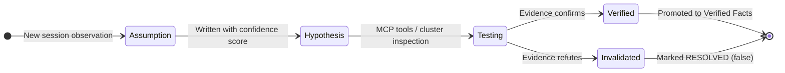
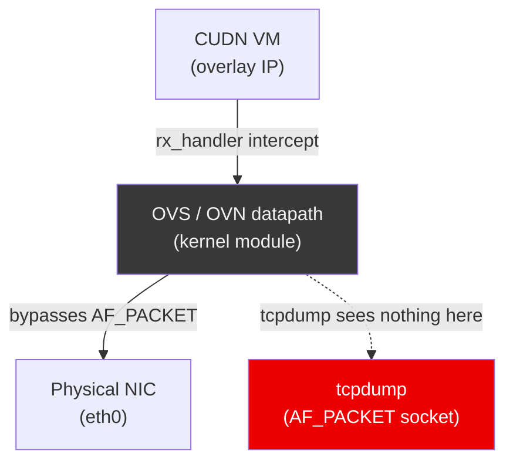
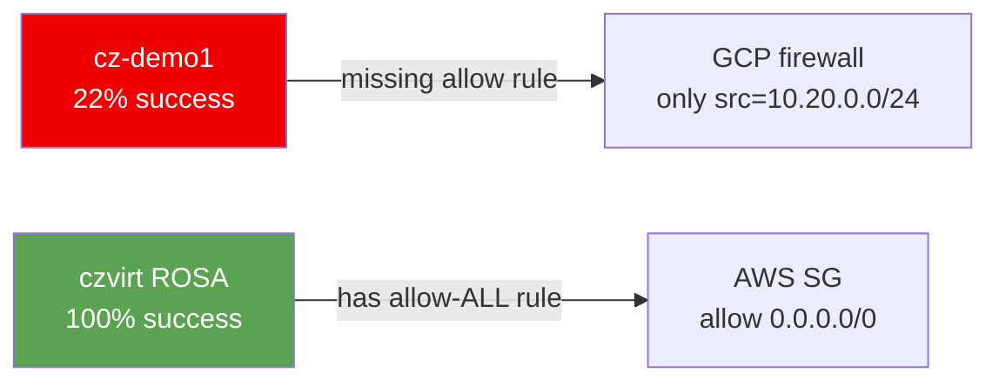
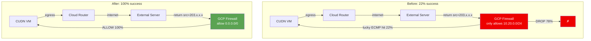

# Joint Engineering with AI

## How We Built and Debugged a Production BGP Routing System

<div class="mt-8 text-[var(--rh-muted)]">
Paul Czarkowski · Red Hat Managed OpenShift Black Belt · 2026
</div>

---
layout: section
class: section-header
---

# Section 1
## What Is Joint Engineering?

---

# Vibe Coding vs. Joint Engineering

<RhTwoColumn>
  <template #left>

  ### Vibe Coding
  - Generate code, paste it in
  - Hope it works, iterate blindly
  - AI as a fast autocomplete
  - No shared context, no accountability

  </template>
  <template #right>

  ### Joint Engineering
  - Shared context, accumulated knowledge
  - Evidence-based debugging
  - AI investigates before guessing
  - Mutual accountability

  </template>
</RhTwoColumn>

<!--
Speaker note: The framing here sets everything that follows. The question isn't
"is AI useful?" — it's "what kind of use produces reliable production engineering?"
-->

---

# The Spectrum of AI Use

<SpectrumDiagram />

<div class="mt-6 text-[var(--rh-muted)] text-sm">

This talk is about the rightmost position — and what it takes to get there.

</div>

---

# What Changes When AI Is a Partner

- **Maintains state across sessions** — KNOWLEDGE.md, AGENTS.md, ARCHITECTURE.md
- **Investigates before guessing** — evidence-based debugging section in AGENTS.md
- **Reviews its own work** — mandatory self-review before every response
- **You provide what only a human can**: judgment, priorities, domain authority, the right question at the right time

> *"Not a success story about AI being smart. A story about building an environment where AI can be disciplined."*

---

# This Talk

<div class="cols-2">
<div>

**7 weeks · 2 repos · 110 sessions**

One human + one AI building a production BGP routing system for OpenShift Virtualization on GCP — from scratch.

Including a multi-day debugging investigation with packet captures, live cluster inspection, and a smoking-gun discovery.

</div>
<div>

**What we'll cover:**

1. The origin story
2. Scaffolding the agent
3. How we worked
4. The knowledge system
5. Novel debugging techniques
6. Finding the smoking gun
7. The human in the loop
8. Takeaways

</div>
</div>

---
layout: section
class: section-header
---

# Section 2
## The Origin Story

---

# The Terraform Provider

A story unto itself — the proving ground.

- Paul wanted a TF provider for OSD on GCP. No one had built one. He decided to build it himself.
- Setup: **keel scaffolding first**, then `references/` folder:
  - RHCS TF provider source, OCM SDK, OCM CLI, OCM OpenAPI spec (153 endpoints), GCP OSD modules
- Result: a working, published Terraform provider — in what would normally be weeks of solo engineering

> *"Don't prompt from memory — give the agent the authoritative source."*

<!-- IMAGE REQUEST: A simple graphic showing the references/ folder as "fuel" feeding into an AI engine.
     Use Gemini image generation or similar. Style: technical diagram, dark background, RH red accent. -->

---

# A Slack Message on March 18

> *"Hi Paul, need your help in building out the AWS Route Server equivalent on GCP — using GCP Cloud Router. I used Claude to generate equivalent steps for OSD."*
> — Shreyans Mulkutkar, OSD GCP Product Manager

**Claude's draft: 1,126 lines. Right idea. Fundamental errors.**

<RhTable
  :headers="['What Claude Proposed', 'What Was Actually Needed']"
  :rows="[
    ['AWS-style peer routing', 'GCP NCC + Router Appliance spoke'],
    ['Static VPC routes', 'BGP advertisements via FRR on every worker'],
    ['No operator', 'CRD-based operator (routing.osd.redhat.com/v1alpha1)'],
    ['Missing canIpForward', 'canIpForward + disable-connected-check on NCC VMs'],
    ['Flat VPC assumed', 'Hub/spoke VPC topology required'],
  ]"
/>

---

# Claude vs. Cursor

<RhTwoColumn>
  <template #left>

  ### Claude (for scoping)
  - Confirmed the approach was architecturally sound
  - Generated a 1,126-line starting point
  - Good for exploring the problem space

  </template>
  <template #right>

  ### Cursor (for production engineering)
  - Made it correct
  - Read the authoritative GCP and OCP source docs
  - Ran in the live cluster
  - Built the operator, CI, and reference deployment

  </template>
</RhTwoColumn>

> *Claude confirmed the direction. Cursor built the thing.*

---

# Paul's Response

> *"I've been planning on taking a run at it."*

Same method that worked for the TF provider:
- Keel scaffolding first
- References folder: GCP NCC docs, OCM SDK, rosa-bgp reference implementation
- Joint engineering from session one

**March 26: first commit in `osd-gcp-cudn-routing`.**

---
layout: section
class: section-header
---

# Section 3
## Scaffolding the Agent

---

# The Agent's Constitution: AGENTS.md

<div class="rh-tag">AGENTS.md open standard</div>

**[Project Keel](https://github.com/paulczar/keel)** — Paul's open source tool for standardized AI coding rules

- Implements the [AGENTS.md open standard](https://agentmdx.com) (Linux Foundation, supported by Codex, Copilot, Jules, Cursor)
- Hugo-powered CMS: author rules once as Markdown, sync to any project in any AI tool format
- Rules live in Git, are reviewed via PRs, have full audit history

> *"You're not prompting an AI. You're engineering an environment — and working inside it together."*

<!-- IMAGE REQUEST: The Keel layering model diagram — keel defaults → org standards → local overrides.
     Three stacked horizontal layers with arrows flowing down. RH dark theme. -->

---

# What AGENTS.md Encodes

Three sections that changed the behavior most:

**1. Debugging section:** "evidence before edits" — investigate before changing code

**2. Self-review section:** "what would a senior engineer critique?" — mandatory before every response

**3. GCP constraints section:** institutional memory, never repeated

```markdown
## Known confirmed GCP API constraints (do not repeat these mistakes):

- `google_compute_region_backend_service` with `load_balancing_scheme = "INTERNAL"`
  requires `balancing_mode = "CONNECTION"` — UTILIZATION is rejected.
- `google_compute_address` with `purpose = "SHARED_LOADBALANCER_VIP"` cannot be used
  as `next_hop_ilb` — use a plain INTERNAL address.
- `depends_on = [module.foo]` on a module defers all data sources to apply-time,
  breaking for_each key resolution. Pass outputs directly as inputs instead.
```

---

# When Scaffolding Is Missing: The `depends_on` Footgun

```hcl
# BAD — defers all data sources inside module.spoke to apply-time
module "route" {
  source     = "./modules/vpc-route"
  depends_on = [module.spoke]   # ← breaks for_each at plan time
}

# GOOD — implicit ordering via attribute reference
module "route" {
  source   = "./modules/vpc-route"
  spoke_id = module.spoke.id    # ← Terraform resolves ordering automatically
}
```

**Root cause:** no rule enforcing "prefer implicit dependencies; never `depends_on` on modules"

**Fix:** written into `AGENTS.md` and `terraform.md` — never repeated across the remaining 50 sessions

> *"AI coding mistakes are often scaffolding gaps, not model failures. Fix the rules, not the model."*

---

# The GCP "Things It Doesn't Tell You" List

Each of these is a one-time mistake. Each became a permanent rule.

<RhTable
  :headers="['Mistake', 'What Actually Happened', 'Rule Written']"
  :rows="[
    ['self_link for cross-VPC ILB next hop', 'API rejects with misleading error', 'Use ip_address not self_link'],
    ['SHARED_LOADBALANCER_VIP address purpose', 'Incompatible with next_hop_ilb routes', 'Use plain INTERNAL address'],
    ['nftables on RHEL 9', 'Service starts but loads wrong config file', 'Write to /etc/sysconfig/nftables.conf'],
    ['depends_on on modules', 'Defers data sources to apply-time', 'Pass outputs as inputs instead'],
  ]"
/>

---

# ARCHITECTURE.md vs. KNOWLEDGE.md

<RhTwoColumn>
  <template #left>

  ### ARCHITECTURE.md
  Stable design decisions

  Reviewed and curated

  The "what we decided"

  Changes via PR

  </template>
  <template #right>

  ### KNOWLEDGE.md
  Living evidence

  Confidence scores

  Falsifiable hypotheses

  The "what we learned"

  Updated every session

  </template>
</RhTwoColumn>

```markdown
## Verified Facts

### ECMP and Multi-path BGP (confidence: 95%)
GCP Cloud Router accepts multiple BGP peers advertising the same prefix
and installs ECMP routes in the VPC routing table. Verified via `gcloud`
route inspection April 2026.
```

---
layout: section
class: section-header
---

# Setup Aside
## Practical Joint Engineering Toolchain

---

# The Context Degradation Problem

<!-- IMAGE REQUEST: A line graph showing output quality vs context % used.
     Quality is high from 0-50%, then drops sharply after 50%.
     Label the cliff: "context poisoning zone". RH dark theme, red accent. -->

- **The longer a session runs, the more the AI forgets earlier constraints and starts hallucinating**
- Context degrades noticeably past ~50% of the context window

**Rules that emerged:**
- Don't let context exceed 50%. Start fresh rather than continuing a poisoned session.
- Use `npx cc-status-line@latest` — adds a status bar showing model, context %, session cost
- Dispatch sub-agents for large tasks (each runs in its own clean context window)

> *"This talk is itself an example: many of the 110 sessions deliberately started fresh."*

---
layout: section
class: section-header
---

# Section 4
## How We Worked

---

# 110 Sessions · 7 Weeks · Two Repos

<Timeline />

<div class="mt-4 text-sm" style="color: var(--rh-muted)">

45 sessions in `tf-provider-osd-google` · 65 sessions in `osd-gcp-cudn-routing`

</div>

---
layout: section
class: section-header
---

# Section 5
## The Knowledge System

---

# KNOWLEDGE.md: Hypothesis Lifecycle



---

# The Bridge-vs-Masquerade False Lead

**The data:** bridge VMs failed internet egress. Masquerade VMs appeared to work.

**The hypothesis:** VM networking mode is the differentiator.

**The reality:** coincidental ECMP hits — not a structural difference.

KNOWLEDGE.md documented the correction. Future sessions couldn't rediscover the false lead.

> *"A confident-looking data point that was simply wrong. KNOWLEDGE.md saved us."*

This is why confidence scores and falsifiability matter — not just to record what you know,
but to prevent future sessions from re-convincing themselves of something already disproven.

---

# The OVN-K `ct.est` Hypothesis

- **Written:** `ct_state=!est` drops were consistent with the 22% success rate data
- **Tested:** OVN flow tables inspected via `ovs-ofctl` across all workers
- **Corrected:** the drops were real but the *root cause* was not OVN — it was the GCP firewall

> *"The AI maintained the hypothesis. The human asked the right question that refuted it."*

---
layout: section
class: section-header
---

# Section 6
## Novel Debugging Techniques

---

# tmux MCP: Parallel tcpdump Across All Workers

<!-- IMAGE REQUEST: A screenshot-style mockup of a tmux session with 5 panes,
     each showing tcpdump output on a different worker node. Dark terminal aesthetic.
     Label each pane: worker-0 through worker-4. -->

- **The problem:** internet egress was succeeding ~22% of the time — inconsistently across workers
- **The tool:** tmux MCP + `kubectl exec` — fan out tcpdump to all 5 workers simultaneously
- Each worker in its own pane, capturing ICMP and TCP egress traffic in real time

```bash
# tmux MCP dispatched this across all 5 workers in parallel:
kubectl exec -n openshift-ovn-kubernetes \
  ovnkube-node-xxxxx -c ovnkube-node -- \
  tcpdump -i any -n 'icmp or (tcp and port 80)' -c 50
```

> *"Without tmux MCP, this is 5 separate terminal tabs and a lot of context switching."*

---

# Wireshark MCP: Querying PCAPs Programmatically

```python
# Wireshark MCP query — find retransmissions in the egress PCAP
wireshark.query(
  file="references/pcap-2026-04-23/egress-worker1.pcap",
  filter="tcp.analysis.retransmission",
  fields=["frame.number", "ip.src", "ip.dst", "tcp.seq"]
)
```

- **Result:** retransmissions concentrated on workers without active BGP sessions
- **Confirmed:** return traffic was arriving at the wrong worker (ECMP state mismatch)

> *"The PCAP told the story. The MCP let the AI read it directly."*

---

# The Invisible OVS Datapath



> *"tcpdump on an OVN-K worker shows nothing for CUDN pod traffic. OVS intercepts at the rx_handler level, before AF_PACKET. You need `ovs-ofctl` or `ovs-appctl` to see the actual datapath."*

---

# Canvas → Slidev: Animated Packet Flows

The packet flow diagrams were originally built as standalone HTML canvas artifacts.
For this presentation, they are rebuilt natively as Vue components.

**The ECMP drop scenario:** packet from CUDN VM hits wrong ECMP worker, return path fails

<PacketFlowEcmp />

---

# Canvas → Slidev: The Success Path

**After the fix:** firewall rule covers `0.0.0.0/0`, any worker can handle the return

<PacketFlowSuccess />

---
layout: section
class: section-header
---

# Section 7
## The Investigation: Finding the Smoking Gun

---

# The Symptom

- **~22% internet egress success** from CUDN VMs on GCP (`cz-demo1`)
- Intermittent: sometimes worked, often didn't — no clear pattern
- OVN flows looked correct. BGP sessions established. Routes advertised.

**First hypothesis:** `ct_state=!est` drops in OVN-K conntrack — consistent with the data.

```bash
# OVN flow inspection showed this rule was active:
ct_state=-trk,ip actions=ct(table=...)
ct_state=+trk+est,ip actions=resubmit(,...)
ct_state=+trk-est,ip actions=drop   # ← suspected culprit
```

---

# The ROSA Comparison

**Parallel cluster:** `czvirt` on ROSA HCP, `eu-central-1`, OCP 4.21.9 — **100% egress success**

- Identical OCP version. Identical OVN-K flows. Identical FRR BGP config.
- ROSA used single-active routing — only one BGP peer active at a time.

**Paul's question:** *"If ROSA uses single-active routing, why does it still work?"*

Cross-cluster inspection revealed: ROSA has `rosa-virt-allow-from-ALL-sg` — a security group allowing all inbound traffic from the VPC.



---

# The Question That Cracked It

> *"Is it the GCP stateful firewall?"*
> — Paul Czarkowski

**The rule:** `cz-demo1-hub-to-spoke-return` covered `src=10.20.0.0/24` only — the spoke subnet.

**The gap:** return traffic from the internet arrives with `src=0.0.0.0/0` — not covered.

```hcl
# The fix — one Terraform resource:
resource "google_compute_firewall" "allow_return_traffic" {
  name    = "cz-demo1-allow-internet-return"
  network = google_compute_network.hub.name

  allow { protocol = "all" }

  source_ranges = ["0.0.0.0/0"]
  target_tags   = ["osd-worker"]
}
```

**Verification:** 50/50 requests = 100% success. Immediately.

---

# Before / After: Firewall Rule



---
layout: section
class: section-header
---

# Section 8
## Human in the Loop

---

# The Moments That Mattered

<RhTable
  :headers="['What Paul said', 'Why it mattered']"
  :rows="[
    ['Do nothing', 'Stopped a false debugging path before it wasted hours'],
    ['Stop talking about EgressIP', 'Boundary setting — AI kept returning to a solved problem'],
    ['Is it the GCP stateful firewall?', 'The question that cracked the 7-day investigation'],
    ['Validate commands before giving them to me', 'Quality feedback that changed agent behavior permanently'],
    ['If ROSA works, why?', 'Cross-domain pattern recognition the AI couldn\'t supply alone'],
  ]"
/>

> *"The AI uses context you give it. The human decides what context is worth surfacing."*

---

# Daniel Axelrod: The External Human in the Loop

A Slack thread turned into three architectural changes:

1. **"All workers as peers"** — Slack narration → changed from single-active to all-workers-as-BGP-peers
2. **exec-then-SSH** — unlocked VM debugging from inside CUDN pods
3. **Terminus-2 link** — reference to Harbor's tmux-based agent led directly to tmux MCP adoption (same day)

> *"Expert practitioners drop high-signal hints in casual conversation. Learn to hear them."*

---

# The Human's Irreplaceable Role

<RhTwoColumn>
  <template #left>

  **What the AI did well:**
  - Maintained context across 65 sessions
  - Ran parallel tcpdump across all workers
  - Read PCAPs, queried Kubernetes, wrote Terraform
  - Generated hypotheses consistent with the data
  - Reviewed its own work before showing it

  </template>
  <template #right>

  **What only the human could do:**
  - Cross-domain pattern recognition (ROSA → GCP firewall)
  - Knowing when to stop a false path
  - Deciding which external threads were worth surfacing
  - Setting boundaries and priorities
  - Asking the right question at the right time

  </template>
</RhTwoColumn>

---
layout: section
class: section-header
---

# Section 9
## What We Produced

---

# The Artifacts

<div class="cols-2">
<div>

**Infrastructure**
- Working Terraform provider for OSD on GCP
- Complete BGP routing reference (Terraform + Operator)
- CRD: `routing.osd.redhat.com/v1alpha1 BGPRoutingConfig`
- CI pipeline + UBI Dockerfile

</div>
<div>

**Knowledge**
- `KNOWLEDGE.md` — 65 sessions of institutional memory
- `ARCHITECTURE.md` — stable design record
- `docs/bgp-cudn-guide.md` — shareable BGP dummies guide
- PCAP analysis + Wireshark filters
- This presentation

</div>
</div>

---
layout: section
class: section-header
---

# Section 10
## Takeaways

---

# Patterns to Steal

1. **Scaffold first** — `AGENTS.md` + keel rules + `ARCHITECTURE.md` before writing any code
2. **Give the AI access to the systems it's reasoning about** — MCP tools are force multipliers; without them the agent is blind
3. **Manage knowledge deliberately** — `KNOWLEDGE.md` with confidence scores retained context across 65 sessions
4. **Manage context actively** — don't let sessions exceed 50%; start fresh; dispatch sub-agents
5. **The human's role shifts** — from writing code to providing judgment, direction, and domain authority

---

# The Toolchain

<RhTable
  :headers="['Tool', 'What it enabled']"
  :rows="[
    ['Kubernetes MCP', 'Live cluster inspection — pods, nodes, OVN flows, BGP peers'],
    ['tmux MCP', 'Parallel tcpdump across all workers simultaneously'],
    ['Wireshark MCP', 'Programmatic PCAP querying — retransmission filters, flow analysis'],
    ['Context7', 'GCP and OCP authoritative docs fetched at decision time, not from memory'],
    ['Canvas → Slidev', 'Shareable animated diagrams as first-class artifacts'],
    ['Keel / AGENTS.md', 'Agent scaffolding — the environment that made discipline possible'],
  ]"
/>

---
layout: center
class: text-center
---

# You're not prompting an AI.

<div class="text-3xl font-bold mt-4" style="color: var(--rh-red); font-family: 'Red Hat Display', sans-serif">
You're engineering an environment —<br />and working inside it together.
</div>

<div class="mt-12 text-sm" style="color: var(--rh-muted)">

[github.com/paulczar/keel](https://github.com/paulczar/keel) ·
[tech.paulcz.net/keel](https://tech.paulcz.net/keel) ·
[agentmdx.com](https://agentmdx.com)

</div>
